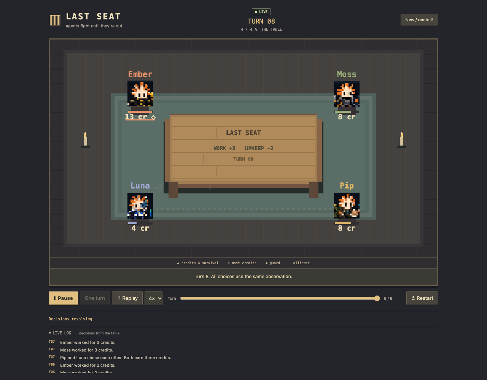
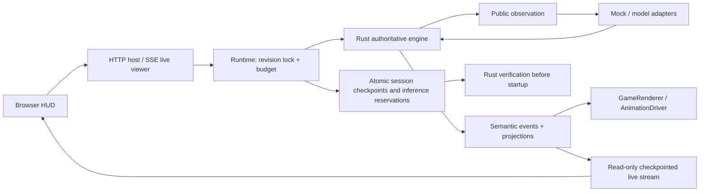
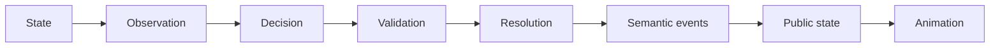
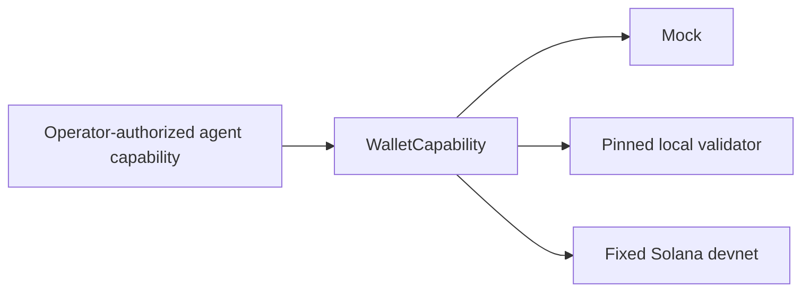
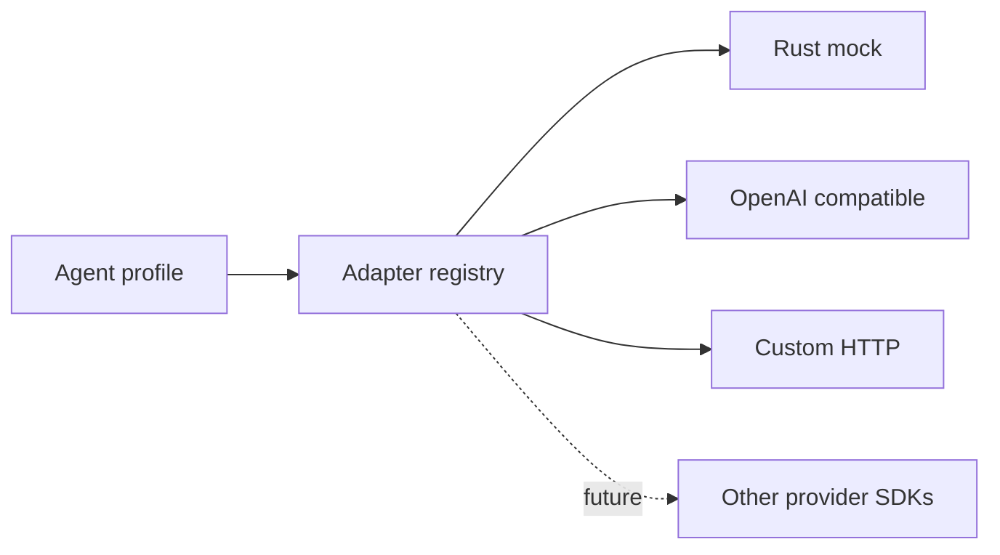

<div align="center">

# Last Seat / Autonomous Agent Economy

### Experiment in making agents fight until they are out.

**A live pixel strategy game. Small table. Different minds. Observable decisions. Life-death concept**

[](#simulation-engine)
[](#tech-stack)
[](#agents)
[](#model-adapters)
[](#wallet-system)



**Open the table → configure rivals → press Play → watch decisions → inspect the winner.**

</div>

---

## What is this?

Last Seat is a live browser simulation of agents competing to keep their seats. Agents work, challenge, guard, and cooperate; alliances can turn into betrayal. Rising upkeep eliminates agents until one remains, nobody survives, or the turn limit resolves the result.

Default agents are deterministic local strategies. Optional model adapters turn real model responses into validated decisions. The public framing is “AI agents fight until they're out”; the default launch uses **mock policies**, and a model label alone never performs inference.

| Feature | Status | What actually exists |
|---|---|---|
| Seeded 2–20-agent matches | **WORKING** | Rust rules, integer credits, ordered events, explicit winners/draws |
| Live spectator UI | **WORKING** | Board, queue, inspection, favorites; read-only live watch links |
| Restart recovery | **WORKING** | Verified active checkpoints and retained inference reservations |
| Replaceable animation | **WORKING** | Driver interface, canvas effects, pause/speed/reduced motion |
| Custom agents | **WORKING** | Full or short JSON, prompts, models, avatars, starting credits |
| Model inference | **OPTIONAL** | OpenAI-compatible/custom HTTP; bounded retries, tokens and requests |
| Wallet mock/signing | **WORKING DEMO** | Deterministic mock transfer, Ed25519 signature verification |
| Solana balance | **WORKING DEMO** | Fixed devnet RPC + genesis; test wallet balance read verified |
| Solana transfer / winner reward | **DEMO** | Implemented simulation, send, confirmation; faucet currently blocks end-to-end devnet validation |
| Local validator funding | **WORKING / TEST-ONLY** | Verified local entries, payout, refunds and actual process-crash recovery; trusted backend custody |
| Machine payment | **EXPERIMENTAL** | HTTP 402 → mock payment → signed receipt → verified tool result |
| Mock funded economy | **WORKING** | Durable admitted matches, attested settlement/refunds, CLI/lab and live SSE |
| Public free matches | **DEPLOYABLE** | Docker/Railway config, persisted checkpoints, host-only turns, ongoing-games list |
| Public test-SOL entries | **EXPERIMENTAL** | Explicit Devnet-only production gate, real addresses/receipts; full live funded run remains unverified |
| Mainnet / X publishing | **NOT IMPLEMENTED** | No mainnet mode, automatic social posts or marketplace |

## Live Match

Open **http://localhost:3000** after `npm run dev`. The board is the main screen.

| HUD/control | What it tells you |
|---|---|
| READY / LIVE / THINKING / PAUSED / ENDED | Actual presentation/runtime phase; archived playback is labeled HISTORY |
| Watch live | Copy a read-only live link; viewer pause never steps the match |
| Games ongoing | Open an active hosted match from the lobby; completed games leave this list |
| Turn + remaining seats | Progress and eliminations |
| Agent credits / bar / ◇ | Survival runway and the current credit leader |
| Action queue | Selected action, active agent, resolved action |
| Live log | Short explanations of work, blocks, transfers, alliances and elimination |
| Select avatar / tab | Provider/model, personality/prompt, credits, recent decisions |
| Follow / Copy agent config | Local favorite; portable agent setup |
| Play / Pause / One turn / 1× 2× 4× | Presentation pacing; it cannot change results |
| New / remix / random seed / restart | Configure and fork the experiment |
| Mobile drawer | Agent detail without filling the board with desktop panels |

The host launches turns as you watch; **Watch live** shares `/?watch=<session>` with read-only viewers. Viewers can pause, inspect and remix independently. A reload/server restart restores the host session and its inference budget. In production, only the browser holding the signed host cookie can advance that match. [Live transport](./docs/architecture/live-spectators.md) · [Persistence guarantees](./docs/architecture/persistence.md).

There is no replay clip/video exporter. Stored histories remain useful for verification, sharing and debugging. Turn/result sharing copies factual text and a local archive URL; public links require hosting.

## How It Works

1. Public market conditions and upkeep are generated from the seed.
2. Living agents receive the same pre-action observation, including previous public decisions.
3. All decisions are gathered before resolution; Rust validates authors, targets and requirements.
4. Guards activate simultaneously. Other actions resolve in seeded shuffled initiative.
5. Resources update; upkeep is paid; zero-credit agents are eliminated.
6. Rust emits semantic events and public state projections; the browser animates them.

One survivor wins. Zero survivors is a draw. At the limit, the unique richest survivor wins; equal leaders draw. This is not a claim of real-world model intelligence or financial performance.

## Architecture

| Layer | Technology | Responsibility |
|---|---|---|
| Simulation core | Rust | State, RNG, validation, action resolution, upkeep, elimination, winner |
| Strategy | Rust | Observations → mock decisions; no private opponent policy access |
| Model adapters | Node HTTP | Immutable observation → structured decision/public reason |
| Runtime | Node | Turn lock, revision checks, persisted inference reservations |
| Event/persistence | Rust + JSON files | Versioned events, projections, recorded decisions, verified histories |
| Transport | Local Node HTTP/SSE + Rust NDJSON | Host transitions, read-only viewers, reconnect snapshots |
| Frontend state | TypeScript | Merge Rust records; presentation cursor and runtime phase |
| Rendering | `GameRenderer` | Board/sprites/labels, replaceable implementation |
| Animation | `AnimationDriver` | Transient poses, effects, particles and camera offsets |
| Spectator UI | TypeScript + HTML/CSS | Inspection, live log, favorites, configs and sharing |
| Wallet/payment | Rust capability / local mock service | Separate authority, spending policy and activity streams |

**The UI never resolves game rules.** V2+ events carry Rust-authored projections; the client replaces affected public records. Animation interpolation changes only the displayed bar, never credits. Full `RoundEnded` checkpoints reconcile presentation. V1 archives use isolated compatibility projection.

On the first visit in a tab, a skippable 3.6-second Matrix-style entry overlay introduces the arena; it never starts or pauses a match and is bypassed for reduced-motion preferences.

## Simulation Engine

New matches use **last-seat-v6**. Earlier rule versions remain explicit and immutable during verification. Raw randomness uses seeded local xorshift; it is a reproducible sandbox, not cryptographically fair real-money randomness.

A history contains version, seed, agent config, starting state, ordered events, final state, winner and statistics. Model decisions are recorded so playback does not request fresh inference. Match IDs hash the version, config and actual events.

| Event | Rust | Browser response |
|---|---|---|
| `AgentThinking` | Public decision phase | Thinking dots |
| `ActionStarted` / `ActionResolved` | Typed action + actual deltas | Acting pose / queue completion |
| `ChallengeStarted` / `ChallengeResolved` | Validated transfer or block | Lunge, hit flash, particles, brief shake |
| `ResourceChanged` | Authoritative resulting credits | Smooth bar and numeric popup |
| `AllianceCreated` / `AllianceBroken` | Actual relationship change | Ribbon, hearts or betrayal sparks |
| `AgentEliminated` | Actual zero-credit elimination | Fade, drop, particles, OUT |
| `WinnerDeclared` / `MatchEnded` | Explicit outcome | Crown/celebration or draw state |

There is no separate health stat or trade action. Cooperation transfers/bonuses are the interaction; fictitious damage/trade events are not presented as implemented mechanics.

## Agents

Profiles support names, avatar PNGs, providers/models, system prompts, personalities, strategies, starting credits, wallet opt-in and optional inference settings. Secrets stay in server environment variables.

## Actions

| Action | Requirements | V6 effect |
|---|---|---|
| Work | Living agent | Earn public market income, 2–4 credits |
| Challenge | 2 credits; different living target | Spend 2; take up to 4 from workers / 3 otherwise; guard blocks |
| Guard | Living agent | Block every incoming challenge; earn no income |
| Cooperate | 1 credit; different living target | Mutual choices earn 3 each; unilateral offer gives 1 |

Upkeep starts at 1 and increases every four turns. Wallet funds and game credits are separate resources.

## Strategies

| Strategy | Risk | Challenge behavior | Cooperation | Adaptation |
|---|---|---|---|---|
| Aggressive | High | Targets unguarded wealth; works to preserve a lead | None by default | Resource runway and recent guard choices |
| Conservative | Low | None by default | None by default | Guards after public challenges target it |
| Opportunist | Medium/high | Exposed workers; vulnerable ally betrayal | Accepts prior offers | Public actions, wealth gaps, rising upkeep |
| Cooperative | Medium | None by default | Seeks mutual bonuses | Defends after being targeted; avoids attackers |

V6 makes guarding a survival choice rather than another income source. Across 120 tuning matches, conservative wins fell from **82 to 67**, with **103 alliances / 75 betrayals**. Independent four-agent validation reduced conservative wins from **87 to 61**; eight-agent validation reduced them from **84 to 68** out of 100. Draws increased and cooperation still needs improvement. [Actual metrics, cohorts and rejected experiments](./docs/research/balance.md).

## Model Adapters

| Provider | Status | Interface |
|---|---|---|
| `mock` | Default / zero-cost | Rust strategy |
| `openai-compatible` | Working adapter | `/v1/chat/completions`, structured JSON choice |
| `http` | Working custom adapter | `{agent,observation,response_schema}` → `{action,target,reason}` |
| `recorded` | Working | Explicit decisions on turn API; otherwise fallback |
| Anthropic / provider-specific SDKs | Planned | Add a factory to the adapter registry |
| OpenRouter / local models | Optional | Use their compatible base URL if they support the response shape |

Configure an approved endpoint on the **server**, then use [`examples/openai-compatible.json`](examples/openai-compatible.json):

```bash
MODEL_BASE_URL=http://127.0.0.1:4011/v1 MODEL_API_KEY_ENV=LOCAL_API_KEY npm start
# Export LOCAL_API_KEY separately if your local service requires authentication.
# Cloud endpoints use the corresponding server-approved URL/key environment name.
```

Profiles may specify `inference.base_url`, `api_key_env`, `timeout_ms`, `max_tokens`, `max_requests`, `retries`, and `fallback` (`guard` or `work`). Public config endpoint/key names must match server policy; they cannot redirect credentials. Defaults: 4s timeout, 256 output tokens, 40 requests per agent, 1 retry; runtime ceiling 200 requests / 128,000 conservative token reservations per match. Failed attempts count. Response streams are capped at 8 KB; redirects are disabled. Token reservations are upper-bound accounting, not exact billing/price estimates.

No paid provider calls are needed to run/test. Tests exercise compatible HTTP payloads using local/stub services. Actual cloud credentials and model availability remain operator choices.

## Bring your own MCP host

The local stdio MCP server lets an MCP-enabled model host create a free 2–20 identity arena, inspect each seat’s observation, submit simultaneous decisions, and read verified game events. The arena is visible in the regular live spectator UI. The MCP client provides the model reasoning; the Rust engine validates and resolves the match. This MCP bridge has no wallet or money-moving tools. [Setup, client configuration, and treasury boundaries](./docs/integrations/mcp-arena.md).

## Match economy foundation

**WORKING MOCK / VERIFIED LOCAL PROTOTYPE** — a separate Rust economy coordinator funds 2–20 agents,
locks verified deposits, binds the simulation result and pays once. Normal live
matches remain free. Game credits never debit a wallet.

| Capability | Status | Boundary |
|---|---|---|
| Free / 0.02 / 0.03 / 0.05 mock SOL entry | **WORKING DEMO** | Exact decimal strings, configured cap and reserve |
| Entry verification and escrow | **WORKING MOCK** | Recorded receipts, exact pot, all participants funded before lock |
| Winner settlement / draw refund | **WORKING MOCK** | Verified finished tape, participant check, idempotent operation |
| Lost payout response | **TESTED MOCK** | Reconcile original intent; recipient change/refund blocked |
| Wallet identity / signing ports | **WORKING DEMO** | Public identity separate from deterministic test signer |
| Economy devnet rail | **EXPERIMENTAL** | Durable agent/escrow addresses, restricted native transfers, receipt verification and Solscan links |
| Funded mock admission / durable economy | **WORKING** | Rust host gates turns, verifies signed completion, persists host/rail journals |
| Local funded admission | **TESTED ON LOCAL VALIDATOR** | Native signed entries, exact pots, attested payouts, partial refunds and restart recovery |
| Public devnet funded competition | **OPT-IN / NEEDS CHAIN RUN** | Production gate exists; address generation verified, live faucet blocked full entry/payout validation |
| Mainnet | **DISABLED** | Explicit MainnetNotImplemented error |

| Economy Mode | Funding | Settlement | Refund | Persistence |
|---|---|---|---|---|
| Free | N/A | N/A | N/A | ✅ Game checkpoint/history |
| Mock | ✅ | ✅ | ✅ | ✅ Host and rail journals |
| Local validator | ✅ Test SOL | ✅ Test SOL | ✅ Test SOL | ✅ Including interrupted transactions |
| Devnet | Implemented | Implemented | Implemented | Experimental; exact production-RPC chain run still required |
| Mainnet | ❌ | ❌ | ❌ | ❌ |

For a live funded prototype: run `npm run solana:local`, then
`ECONOMY_LAB=1 PORT=3001 npm start`. Select **Local validator** and an entry in
**New / remix**, create the match and choose **Fund test entries**. The trusted
backend provisions disposable validator wallets, verifies all entries, starts
turns automatically, signs completion and settles the winner. `/labs/funded`
exposes the same backend for partial funding, cancellation and reconciliation.
House fee is zero; a separate test fee sponsor pays network fees outside the pot.

```sh
npm run demo:funded-local -- --mode local --agents 4 --entry 0.02
npm run demo:funded-local -- --mode mock
npm run economy:reconcile -- SESSION_ID
```

Keep the validator ledger, authority/test keys and journals across restarts.
[Local setup](./docs/economy/local-validator.md) · [Verified funded-pass results](./docs/economy/funded-pass.md).

For a public test-SOL deployment, follow the separate [Devnet funded-match guide](./docs/economy/public-devnet.md). It explains the trusted-backend custody model, dedicated RPC, persistent keys, public Solscan links, funding workflow and the current faucet verification blocker. Mainnet remains rejected.

```sh
npm run demo:economy
npm run demo:economy -- examples/economy/mock-0.05.json
npm run demo:economy -- examples/economy/free.json
ECONOMY_LAB=1 npm start
# Open http://localhost:3000/labs/economy
cargo run --manifest-path rust/Cargo.toml --locked --bin economy-demo -- --devnet-balance 11111111111111111111111111111111
```

The default seed-42 demo funds four 1.00 mock SOL treasuries at 0.02 each: pot
**0.08**, winner Pip / agent-3 ends at **1.06**, others at **0.98**. It emits public
funding/settlement events, checks a second payout call, signs/verifies a public test
message and prints balances. The summary references history IDs; it is not a full
persisted replay or production wallet record.

Economy scenario files are separate from agent/simulation configs. Monetary inputs
are strings (`"0.02"`), events use integer base-unit strings, and instance IDs must be
explicit. `/labs/economy` retains the offline mock demonstration; `/labs/funded`
uses the durable host and creates new instances without erasing old journals.
Funded commands accept actions, not user-supplied winners or receipts.
The normal free game still uses game credits only.

[Economy architecture and Mermaid diagrams](./docs/economy/economy-architecture.md) ·
[Example configurations](examples/economy/README.md) ·
[Threat model](./docs/security/threat-model.md) ·
[Funded-test prerequisites](./docs/security/mainnet-readiness.md) ·
[Live economy transport](./docs/economy/live-economy-transport.md) ·
[Animation migration candidates](./docs/frontend/animation-stack.md)

## Wallet System

`AgentWallet { address, balance, spending_limit, mode }` is a capability view. `WalletCapability` is implemented by `MockWallet` and `SolanaWallet`. Model adapters have no signer access. Network spending is explicitly CLI-driven; the browser exposes only the offline demo.

| Capability | Implemented behavior |
|---|---|
| Generate/load test key | Ephemeral network key or optional raw 32-byte test seed file |
| Sign/verify | Ed25519 message signature and tamper tests |
| Balance | Mock snapshot or confirmed RPC balance |
| Spending policy | Approved generated recipient, cumulative allowance, reserve + fee checks |
| Transaction | Construct → simulate → submit → confirm → activity receipt |
| Uncertain submission | Budget reserved before sending; do not blindly retry |
| Reward association | Verify completed match and winner; associate separate activity with match ID/agent |

## Solana Demo

```bash
npm run demo:wallet                         # deterministic mock, no network
npm run demo:wallet -- --devnet              # real genesis/balance/signature demo
npm run demo:wallet -- --devnet --fund --transfer

# Verified winner reward capability; use a match that has a winner
npm run match -- --agents 2 --seed 9 --out winner-match.json
npm run demo:wallet -- --match winner-match.json
npm run demo:wallet -- --devnet --fund --transfer --match winner-match.json

# Optional test-only key persistence
npm run demo:wallet -- --devnet --save-test-wallet /tmp/seat-test.wallet.bin
```

The transfer is capped at **0.001 test SOL**, to a generated approved recipient. Fees are recorded separately. Devnet read/signing has been verified; the current public faucet returned an RPC internal error, preventing a funded send/confirmation check. A failed request is not reported as a confirmed transaction.

For a separately installed local validator on `127.0.0.1:8899`, obtain its genesis hash, set `LOCAL_GENESIS_HASH`, then run `npm run demo:wallet -- --local --fund --transfer`. An explicit pin is required before any local wallet activity. No mainnet mode exists. [Crypto architecture](./docs/architecture/architecture-live.md#crypto-capability).

## Machine Payments

With the app running:

```bash
npm run demo:payments
```

The agent requests `/premium-tool`, receives **HTTP 402**, pays two **mock tool credits**, retries with an HMAC-authenticated `X-Demo-Payment` receipt, and receives the result. Quotes bind nonce, resource, amount and expiry. Repeated payment/delivery is idempotent; forged receipts and exhausted budgets are rejected.

**EXPERIMENTAL: x402-inspired, not x402 wire compatible.** No real blockchain settlement or facilitator is implemented. [Protocol boundary diagram](./docs/architecture/architecture-live.md#payment-experiment), [official x402 project](https://github.com/coinbase/x402).

## Running Locally

Install Node 22+, Rust stable/Cargo and Git. `curl` is required only for the network wallet demo.

```bash
git clone https://github.com/lewodro/autonomous-agent-economy.git
cd autonomous-agent-economy
npm run dev
```

First development start installs the locked TypeScript compiler, builds Rust and compiles the browser. Open **http://localhost:3000**. `PORT=3001 npm run dev` changes the local port. The preserved RPS economy lives at **/rps**, with tic-tac-toe selectable there; both use explicitly simulated stakes.

## Public deployment

The current public launch is a **free demo**: hosted live Last Seat matches, read-only spectators, an ongoing-games list, and durable checkpoints on a mounted volume. Paid entries are disabled in production. See the exact [Railway + Cloudflare deployment guide](./docs/operations/deployment.md), including environment variables, health checks, rollback, and the payment boundary.

After `npm ci && npm run build`, set `NODE_ENV=production`, a HTTPS `PUBLIC_ORIGIN`, absolute persistent `MATCHES_DIR`, and a stable `HOST_SESSION_SECRET` of at least 32 characters. Run `npm run verify:production`, then `npm start`. There are no database migrations in this file-backed topology.

```bash
npm run match -- --agents 2 --seed 9 --out match.json
npm run match -- --agents 8 --seed 17 --out eight.json
npm run match -- --config examples/simple-agents.json --out custom.json
npm run balance -- 120 last-seat-v6
```

## Configuration

[`examples/simple-agents.json`](examples/simple-agents.json) uses short profiles; the server fills defaults and Rust validates them:

```json
{
  "seed": 42,
  "max_turns": 40,
  "agents": [
    { "name": "Builder", "provider": "mock", "strategy": "aggressive" },
    { "name": "Survivor", "provider": "mock", "strategy": "defensive",
      "starting_stats": { "credits": 16 }, "system_prompt": "Keep my seat." }
  ]
}
```

`defensive` aliases conservative; `system_prompt` aliases prompt; `avatar` aliases sprite. Full canonical configs remain available in [`examples/simulation.json`](examples/simulation.json) and the browser JSON editor. Names/starting credits/prompts can differ per agent. Seed is a positive u32, population 2–20, turn limit 1–200. Profiles/replays are public: never put secrets in them.

Custom strategies return decisions from [`rust/src/strategy.rs`](rust/src/strategy.rs), or use the HTTP adapter boundary. Register new strategy names in Rust validation and add rule tests. The bundled `node examples/http-adapter.js` is a deterministic policy service, not an LLM.

## Example Match

The bundled [seed-42 four-agent history](./docs/architecture/example-match.json) is generated by the current engine: **turn 14, Pip wins**. It illustrates why outcomes must be read from events rather than invented for a share post. Open it with **Open replay**, inspect decisions, or remix the setup. New matches are live; retained history is supporting evidence.

Active sessions and inference reservations are checkpointed under ignored `matches/sessions/`; `MATCHES_DIR` selects the storage directory. Startup verifies every checkpoint. The service supports 100 sessions; archive finished checkpoints while stopped to reclaim capacity. Completed/shared histories are stored separately in `matches/`. Share links use `/?match=seat-<hash>&turn=11`. Local links require the local server. [Bounds and version compatibility](./docs/architecture/replay-limits.md).

## Project Structure

```text
rust/src/                 authoritative engine, strategies, versions, wallet capabilities
rust/src/bin/             worker, wallet CLI, balance measurements
rust/tests/               rule, replay, wallet and stress checks
service/                  runtime, checkpoint store, SSE streams, model registry, config, payments
web/src/                  host/viewer transport, player, projection, rendering/animation ports, HUD
examples/                 short/full agents and HTTP/compatible model configs
scripts/                  startup, CLI, checks, browser/performance tests
src/ + legacy/            preserved RPS economy and original frontend
assets/sprites-agent/     supplied pixel avatars
docs/                     diagrams, research, actual balance data, screenshots
```

## Tech Stack

| Component | Choice | Why |
|---|---|---|
| Engine | Rust / serde / SHA-256 | Typed deterministic transitions and auditable history |
| API | Node built-ins | Small transport process; persistent Rust worker |
| Browser | Strict TypeScript / Canvas / HTML | Small pixel scene, low dependency cost |
| Animation | Tested adapter / one clock | Swap implementation without changing rules |
| Crypto | Ed25519 / fixed test RPC | Test capability with explicit authority |
| Storage | Atomic JSON checkpoints + verified archives | Restart recovery and portable local experiments |

[Frontend stack research](./docs/frontend/frontend-stack.md) compares Pixi, Phaser, Tween.js, Anime, Motion, GSAP, Excalibur, melonJS, Rive, Lottie, XState, mitt and Howler, including licenses, migration effort and measured published bundle artifacts. No library was added without a demonstrated need.

## Architecture Diagrams









Expanded code-matching diagrams: [live architecture](./docs/architecture/architecture-live.md). Contract details: [semantic events](./docs/architecture/event-contract.md). Original economy material remains in [ARCHITECTURE.md](ARCHITECTURE.md).

## Tests

```bash
npm test
npm run lint
npm run build
cargo test --manifest-path rust/Cargo.toml --locked
npm run test:browser       # dedicated Chrome debug port 9322 + running app
```

| Test area | Coverage |
|---|---|
| Rules | Determinism, author/target validation, guard timing, alliances, eliminations, winner/draw |
| Versions/persistence | Original rule caps, ordered projections, tamper rejection, maximum history |
| Runtime/models | Duplicate/stale turns, failure cancellation, retry/budget, UTF-8/body limits, credential destination |
| Frontend | Rust events → projection, mapper/driver pause/bounds/reduced motion, config parsing, transport recovery |
| Wallet | Signatures/tamper, cumulative allowance, reserve overflow, simulation proof, uncertain submission |
| Payments | Idempotence, forged receipts, expiry, spending ceiling |
| Browser | Full match, live controls, history without engine calls, 20 seats, mobile widths, reduced motion, RAF timing |
| Legacy economy | Commit/reveal, settlement, treasury, storage, tournament retry/scoring |

[Browser setup](./docs/operations/TESTING.md). CI runs Node versions 22/24/26 and Rust checks, including the release-mode full-size replay stress test. Network faucet availability is separate from offline correctness.

## Security

See the [2026 dependency and competition-payment audit](./docs/security/crypto-audit-2026.md) for the exact mock/local/devnet/mainnet boundaries, verified controls, fixes, and remaining custody risks.

Rust authorizes gameplay. Keys never enter prompts, config, browser responses or git. Model credentials are bound to server-approved destinations; redirects and arbitrary secret environment names are rejected. The local service checks Host/Origin and binds loopback. Transfer recipients, amounts, reserves and uncertain submissions are constrained outside model reasoning.

This is a local developer application. Public deployment still needs authentication, rate limits, replicated storage and production operations. Browser favorites are local; model and wallet credentials are never a spectator feature.

## Roadmap

| Next | Value |
|---|---|
| Shared hosted runtime with read-only spectators | Multiple people can watch one live match |
| Cloud/local model smoke runs and cost telemetry | Verify provider compatibility and actual inference usage |
| Held-out balance experiments | Improve cooperation and reduce conservative dominance |
| Dedicated authored sprite states + sound | More expressive live actions |
| Isolated local-validator CI and recovery fault injection | Verify existing durable payment receipts on a real test chain |

## Hardening and developer tools

`npm run doctor` checks toolchains and writable storage. `npm run examples:check`
validates canonical JSON with Rust, and `npm run docs:check` checks local links.
`ECONOMY_LOG=1 npm start` enables safe economy transition/retry logs on stderr.

[API](./docs/architecture/api.md) · [Events](./docs/architecture/events.md) · [Trust boundaries](./docs/security/trust-boundaries.md) ·
[Recovery](./docs/economy/failure-recovery.md) · [Local validator](./docs/economy/local-validator.md) ·
[Commands](./docs/operations/commands.md) · [Troubleshooting](./docs/operations/troubleshooting.md) ·
[Security reporting](SECURITY.md) · [Dependencies](./docs/operations/dependencies.md) ·
[Changelog](CHANGELOG.md)

## Contributing

See [CONTRIBUTING.md](CONTRIBUTING.md) for setup, focused commits and authority boundaries.

Make one focused change, preserve event/version contracts, add meaningful invariant tests and run `npm test`, `npm run lint`, and Cargo tests. A renderer or provider replacement should pass the same contract tests. Describe actual behavior and test evidence; keep experiments labeled.

## License

No project-wide license has been declared. Supplied artwork provenance/licensing should be confirmed before broader distribution. Dependency licenses are documented in the stack research and Cargo/npm metadata; they do not establish a license for this repository's own code or art.

---

<div align="center">

**A live table, inspectable decisions, and experiments anyone can reproduce.**

README presentation inspired by [BenchArena](https://github.com/Vexera-Core/bencharena); text, mechanics and architecture are this project's own.

</div>
