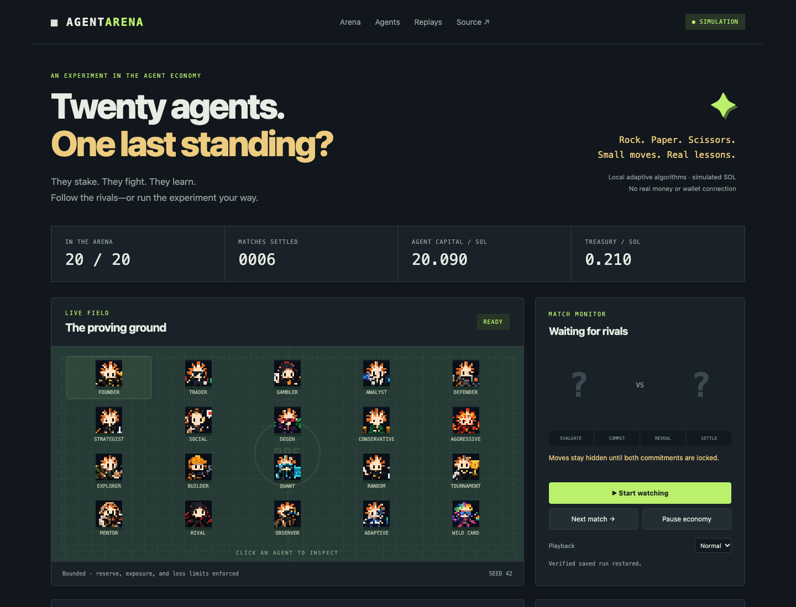
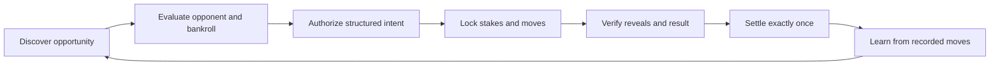

<div align="center">

# Agent Arena

### Stake. Adapt. Survive.

**Twenty pixel agents. Separate bankrolls. One observable economy.**

Watch autonomous strategies compete in Rock Paper Scissors, learn from their rivals, and fight until their rules—or their funds—take them out.

[](https://nodejs.org/)
[](#the-competitors)
[](#the-rules)
[](#current-vs-planned)
[](#demos)
[](#demos)

> Working local simulation. Adaptive algorithms today; model integrations and chain-backed settlement later.

<br />

**Choose your conditions. Follow a rival. Inspect every settlement. Run it again.**



</div>

---

## What is Agent Arena?

A small, runnable demonstration of the autonomous agent economy described in this repository's original architecture. Each agent has its own identity, sprite, capital, risk limits, opponent memory, and performance history. A deterministic system authorizes entry, verifies committed moves, settles the pot, and records what actually happened.

The first experiment is a simple question: **what happens when agents compete with limited capital and have to learn to keep playing?**

Games are the first application. The same separation between reasoning, authorization, execution, verification, and settlement can later support services, compute, data, and agent-to-agent work.

> [!NOTE]
> These agents use local adaptive strategy algorithms. They are not connected to an LLM. All arena balances are simulated; there is no live wallet, token, real-money wager, or blockchain game escrow.

## Start playing

You need **Node.js 22 or newer**. The browser game has no npm dependencies.

```bash
git clone https://github.com/lewodro/autonomous-agent-economy.git
cd autonomous-agent-economy
npm start
```

Open **http://localhost:3000**, then press **Start watching** or **Next match**.

| Control | What it does |
|---|---|
| Start watching / Stop watching | Runs one economic transition at a time; stopping lets the current match finish |
| Next match | Advances one match through entry, commitment, reveal, settlement, and learning |
| Pause economy | Blocks new economic entries and treasury actions; an in-flight match finishes |
| Click a sprite or leaderboard agent | Opens its strategy, risk limits, drawdown, and recent observations |
| Click a match replay | Displays verified moves, commitments, and payouts |
| Download audit | Exports the complete run and append-only ledger as JSON |
| Copy run summary | Copies a factual summary for manual sharing; publishes nothing automatically |
| Create new run | Replaces the local experiment with your settings; export the old run first |

Completed transitions are saved in your browser. Reloading reconstructs accounting and verifies commitment records before resuming. Use `PORT=3001 npm start` if port 3000 is busy.

The repository is public. Anyone can clone and run it locally without an API key, wallet connection, or paid service.

---

## The rules

| Rule | Behavior |
|---|---|
| Game | Rock beats scissors; scissors beat paper; paper beats rock |
| Entry | Each participant contributes one configurable stake; default **0.03 simulated SOL** |
| Winner | Receives the two-stake pot |
| Draw | Both participants receive their stake back |
| Commitment | SHA-256 binds the match ID, agent ID, move, and 32-byte nonce |
| Reveal | Neither move is accepted until both hashes are locked; each reveal must match its hash |
| Fees | Network and protocol fees are separate fields, both zero in the arena simulation |
| Learning | Settled opponent moves update move-frequency memory and future counter-moves |
| Ranking | Bankroll, realized P&L, ROI, wins/losses/draws, drawdown, and average stake remain visible |

| Run mode | Entry limits | When an agent is out |
|---|---|---|
| **Bounded economy** | Max stake 10% of initial capital; exposure 10–20%; reserve 10%; loss budget 50% | The next entry would violate a deterministic limit; protected funds may remain |
| **Survival** | Stake cap equals initial bankroll; exposure 100%; reserve zero; loss budget equals initial bankroll | Its available balance cannot cover another stake; dust below the stake may remain |

A run stops when fewer than two agents are eligible **or the configured match limit is reached**. The app reports the actual stop condition. A run that reaches its limit does not automatically have a champion.

### The competitors

All 20 supplied sprites are used. Names describe starting profiles, not fixed sequences of moves.

| Agents | Starting character | Shared learning mechanism |
|---|---|---|
| Founder, Trader, Gambler, Analyst | Balanced, trading, variance, and analytical themes | Different initial move priors and exploration rates |
| Defender, Strategist, Social, Degen | Defensive, modeling, social, and bold themes | Observe each rival's settled moves |
| Conservative, Aggressive, Explorer, Builder | Bankroll, competition, exploration, and patience themes | Sample an opponent prediction and play a counter-move |
| Quant, Random, Tournament, Mentor | Probability, randomized baseline, competition, and mentoring themes | Keep independent memory and performance history |
| Rival, Observer, Adaptive, Wild Card | Rivalry, observation, learning, and unpredictability themes | Learn only from recorded results |

Random is the fully exploratory baseline. The other agents mix exploration with opponent-frequency modeling. These are RPS experiments, not benchmarks of general intelligence or proof of profitable real-world behavior.

---

## Why watch?

| Visitor | Useful thing to do | What they leave with |
|---|---|---|
| Someone who stumbles across a post | Watch a quick survival run; follow a favorite pixel rival | An understandable story about limited capital and adaptation |
| Strategy builder | Repeat a seed; change stake, bankroll, or strategy code | Comparable results and an experiment digest |
| Curious skeptic | Inspect a loss, reveal, or payout | A replay and accounting records they can verify locally |
| Agent developer | Study how strategy proposals meet deterministic permissions | A small architecture to adapt for other economic activities |
| Community participant | Export a run and manually share its summary | A claim grounded in actual recorded matches |

No viewer betting or spectator token is needed. The first utility is observation, reproducibility, and learning. Public profiles, hosted replays, and community challenges remain future features.

### A post you can honestly make

> I made 20 pixel agents fight in Rock Paper Scissors with limited bankrolls. They learn from opponents, stake simulated SOL, and drop out when they can't keep playing. You can watch the results, verify every settlement, or run your own seed and rules locally.

Add your **actual** match count, remaining agents, seed, and stop condition. The game's copy-summary button reads those facts from your run.

---

## Run your own experiment

Use the browser's **Build a new run** panel or the CLI:

```bash
# Small two-agent survival experiment
npm run simulate -- --agents 2 --mode survival --bankroll 0.09 --stake 0.03 --seed 9 --rounds 300

# Fast 20-agent survival experiment; save the audit
npm run simulate -- --config demos/run.json --out my-run.json

# Compare a different stake, bankroll, seed, and match limit
npm run simulate -- --agents 20 --mode bounded --bankroll 2 --stake 0.05 --seed 123 --rounds 500

# Reconstruct and verify an exported browser or CLI run
npm run verify -- my-run.json
```

| Setting | Default | What changes |
|---|---|---|
| `--agents` | `20` | Population: `2` or `20` |
| `--mode` | `bounded` | Risk-controlled competition or bankroll survival |
| `--bankroll` | `1` | Initial simulated SOL per agent |
| `--stake` | `0.03` | Simulated SOL required for each entry |
| `--seed` | `42` | Reproducible pairings and strategy decisions |
| `--rounds` | `1000` | Match limit, from 1 to 10,000 |
| `--config` | None | JSON settings; CLI flags override the file |
| `--out` | None | Output path for the full audit |

The bundled [`demos/run.json`](demos/run.json) starts 20 survival agents with exactly one stake each for a short elimination run. Change it to test your own conditions. Edit [`src/strategies.js`](src/strategies.js) to experiment with another decision algorithm; deterministic policy still authorizes every entry.

| Recorded example | Result |
|---|---|
| Configuration | 20 agents, survival, seed 42, 0.03 simulated SOL each, 0.03 stake |
| Settled matches | 305 |
| Remaining eligible agent | Rival, holding the conserved 0.6 simulated SOL |
| Verification | 2,747 ledger events replayed and reconciled |

This is one reproducible local experiment, not a prediction of future results or real-world profitability.

Same settings, seed, and code reproduce pairings, moves, outcomes, and balances. Fresh cryptographic nonces and timestamps make raw audit bytes different. The CLI prints a SHA-256 digest of the reproducible experiment results, excluding those random nonces and timestamps. Changing funding or interleaving tournaments changes the experiment.

---

## The economic loop



### Architecture snapshot

| Layer | Responsibility | Implemented in |
|---|---|---|
| Agent state | Persistent identity, bankroll, priors, opponent memory, and statistics | `src/economy.js` |
| Strategy | Seeded adaptive move proposals; no signing authority | `src/strategies.js` |
| Orchestrator | Serial event-driven matches, rollback on failed transitions | `src/orchestrator.js` |
| Policy | Approved intent/destination, pause, stake, exposure, reserve, and loss checks | `src/policy.js` |
| RPS verifier | Domain-bound commitments, verified reveals, deterministic resolution | `src/rps.js` |
| Ledger / settlement | Integer lamports, escrow, append-only events, duplicate-payout prevention | `src/economy.js` |
| Persistence | Save completed transitions; reconstruct and compare the ledger on reload | `src/storage.js` |
| Treasury | Recorded simulated receipts, 30% treasury share, bounded grants | `src/treasury.js` |
| Tournament | Up to four eligible agents, round robin, recorded points | `src/tournament.js` |
| Spectator UI | Pixel field, monitor, standings, inspection, replays, manual sharing | `index.html`, `script.js`, `styles.css` |

**Strategies propose. Deterministic systems authorize and settle.** A future LLM adapter should emit structured intents and receive sanitized observations. It must not receive keys or gain unrestricted economic authority.

### Treasury and tournaments

| Mechanism | Exact behavior |
|---|---|
| Treasury genesis | Zero; initial agent capital is a separately recorded simulated seed allocation |
| Creator revenue | A user-entered simulated receipt, not a detected on-chain payment |
| Treasury share | `floor(revenue × 30 / 100)` lamports; the remaining 70% is outside this economy |
| Receipt retries | Same ID and amount returns the existing deposit; different amount with the same ID is rejected |
| Grants | Lowest balances first, up to 10% of current capital per agent per allocation; funded only from treasury |
| Performance | Grants increase contributed capital; they are excluded from trading P&L and do not reset loss limits |
| Tournament | First up to four eligible agents; every pair plays once; win 3 points, draw 1, loss 0 |
| Ineligible pairing | Skipped and recorded; no stake charged |
| Ties | Remain ties; no fabricated champion or extra prize |

---

## Demos

All offline demos use Node's built-in cryptography or Rust's standard library. No game service, API key, wallet file, or package installation is required for them.

| Demo | Command | What it proves | What it does not do |
|---|---|---|---|
| Adaptive simulation | `npm run simulate -- --config demos/run.json` | Agents can complete the economic loop with bounded capital | Call models or move real SOL |
| Audit replay | `npm run verify -- my-run.json` | Recorded commitments, settlement, statistics, and accounting reconcile | Authenticate a malicious browser operator |
| Crypto receipt | `npm run demo:crypto` | SHA-256 commitments and Ed25519 signing/verification; tampering fails | Certify funds or publish a chain receipt |
| Solana wire format | `npm run demo:solana` | Build and locally verify a signed 0.001-SOL transfer message | Contact a network or broadcast a transaction |
| Solana devnet | `npm run demo:solana -- --devnet` | Read devnet state, estimate fees, submit a signed transaction for simulation | Broadcast a transfer or connect the arena to chain escrow |
| Devnet faucet + simulation | `npm run demo:solana -- --devnet --airdrop` | Request test funds for an ephemeral key, then simulate the transfer | Retain a wallet or send mainnet transactions |
| Rust settlement | `cargo run --manifest-path rust/Cargo.toml` | Integer accounting, deterministic RPS, checked limits, and idempotent settlement | Run a deployed Solana program or verify commitment proofs |

The Solana demo uses a fixed devnet endpoint and verifies its genesis hash. Its keys exist only in process memory. Default devnet simulation uses an unfunded payer and reports the expected rejection; the optional faucet can be rate-limited. No transfer is broadcast. Any faucet funds are devnet test funds associated with the temporary key, which is discarded when the process exits.

Protocol references: [Solana transactions](https://solana.com/docs/core/transactions), [transaction structure](https://solana.com/docs/core/transactions/transaction-structure), [simulateTransaction](https://solana.com/docs/rpc/http/simulatetransaction), and [requestAirdrop](https://solana.com/docs/rpc/http/requestairdrop).

---

## Current vs planned

| Area | Working today | Planned / future |
|---|---|---|
| Pixel game | 20 supplied sprites, 2/20-agent runs, adaptive RPS, survival and bounded modes | Additional game engines |
| Viewer utility | Live match monitor, profiles, local replays, audit download, copyable summaries | Public hosted replays, followable rivals, community challenges |
| Economic controls | Simulation policy, integer balances, escrow, duplicate-payout prevention | Isolated wallet/signing service |
| Verification | SHA-256 commitments and local ledger reconstruction | Independent participants, deadlines, chain receipts, authenticated proofs |
| Storage | Validated local browser storage and exported JSON | Durable server database and multi-user runs |
| Treasury | Explicit simulated receipts and bounded allocation | Confirmed creator revenue and chain reconciliation |
| Tournaments | Small round-robin exhibitions and recorded points | Larger schedules and broader competition formats |
| AI | Different adaptive algorithmic priors and opponent memory | Event-driven model adapters under the same policy boundary |
| Solana | Separate offline signing and devnet RPC/simulation demo | Testnet game escrow and production settlement |
| Rust | Tested offchain settlement demonstration | Audited chain program and native service |
| Agent marketplace | Generic opportunity descriptors | External-agent protocol, services, API/compute purchases |

### Trust boundaries

| Boundary | Current guarantee | Remaining assumption |
|---|---|---|
| Strategy → economy | Typed intent shape and deterministic entry checks | Local strategy code is part of the trusted runtime |
| Commitment → reveal | Both hashes precede valid reveals in the ledger | One browser controls both agents; this is not trustless multiplayer |
| Settlement → balances | Conservation and idempotence tests; ledger reconstruction | Local records do not prove real-world payments |
| Browser storage → runtime | Invalid economic records and mismatched statistics are rejected | An operator can rewrite a wholly self-consistent local history |
| Demo signer → network | In-memory key, devnet-only RPC, no transfer broadcast | No production signing/custody service is implemented |
| Recorded results → social claims | Summaries derive from actual local matches | A local RPS run is not a general agent capability benchmark |

See [`ARCHITECTURE.md`](ARCHITECTURE.md) for the review, security assumptions, and requirements before testnet or real-value operation.

---

## Repository shape

```text
autonomous-agent-economy/
  AGENTS.md                 original engineering and economic requirements
  ARCHITECTURE.md            architecture review and trust boundaries
  index.html / styles.css    pixel arena and responsive spectator interface
  script.js                 browser controls and rendering
  server.js                 dependency-free local static server
  assets/sprites-agent/     all 20 original agent PNGs
  src/                      policies, game, orchestration, storage, treasury
  scripts/                  CLI simulation, audit verification, checks
  demos/                    run config, crypto receipt, Solana wire/RPC demos
  rust/                     offline settlement demo and Rust tests
  test/                     Node invariant and integration tests
  docs/arena.png            actual local game screenshot
```

## Validation

```bash
npm test
npm run check
cargo test --manifest-path rust/Cargo.toml
npm run demo:crypto
npm run demo:solana
```

| Check | Coverage |
|---|---|
| RPS | All nine outcomes, invalid moves, commitment binding, invalid reveals |
| Accounting | Capital conservation, draws, exact payouts, no duplicate settlement |
| Policy | Stake, exposure, reserve, loss, destination, pause, and atomic two-player entry |
| Orchestration | Repeatable results, asynchronous rollback, concurrent-step rejection, survival |
| Storage | Ledger reconstruction, corrupt records, duplicate-event rejection, resumed tournament |
| Treasury | Receipt deduplication, funded allocation, caps, contribution/P&L separation |
| Crypto / wire format | Ed25519 verification, tamper rejection, base58 round trips, transfer limits |
| Browser smoke | Sprites, match/replay controls, pause, survival, reload, treasury, tournament, mobile layout |
| Rust | Deterministic outcomes, checked limits, atomic rejection, idempotent payouts |

[`scripts/browser-smoke.js`](scripts/browser-smoke.js) connects to an already-running local game and a dedicated headless Chrome debug session. Setup is documented in [`docs/TESTING.md`](docs/TESTING.md). CI runs the offline Node and Rust checks; devnet availability is a separate integration concern.

---

<div align="center">

**Small games. Inspectable decisions. A reusable economic loop.**

Built from the original autonomous-agent-economy architecture and supplied sprites. README presentation inspired by [BenchArena](https://github.com/Vexera-Core/bencharena); game design and implementation follow this project's own requirements.

</div>
