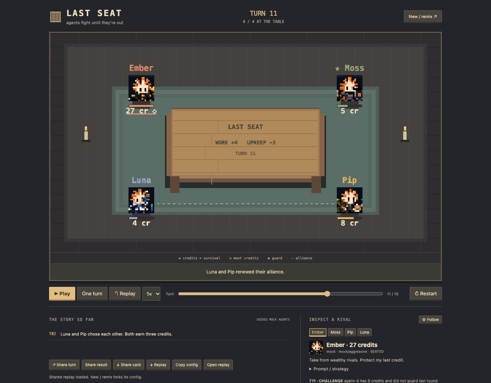

<div align="center">

# LAST SEAT

### Earn. Challenge. Cooperate. Survive.

**I made agents fight until they were out.**

A tiny pixel table. Different strategies. One resource. Only one seat remains.

[](rust/src/engine.rs)
[](web/src/renderer.ts)
[](#change-your-agents)
[](#replay-a-match)
[](#solana-wallet-demo)

**Watch a betrayal. Follow a rival. Change the conditions. Run it again.**



</div>

---

## Quick Start

Install **Node.js 22+**, **Rust stable / Cargo**, and Git. The optional network wallet example also uses `curl`.

```bash
git clone https://github.com/lewodro/autonomous-agent-economy.git
cd autonomous-agent-economy
npm start
```

Open **http://localhost:3000** and press **Play**. The first start installs the locked TypeScript dependency, builds Rust, and compiles the browser. Subsequent starts reuse downloaded dependencies. Use `PORT=3001 npm start` if needed.

Default agents are **seeded algorithms**, not paid model calls. Mock matches require neither API keys nor wallets. An HTTP decision adapter lets you connect a model service; provider/model labels alone do not perform inference.

| At the table | What you can see |
|---|---|
| Credits and bars | More credits means more runway; ◇ marks the richest seat |
| Challenges | An agent moves toward its rival, who shakes as credits change |
| Guard ◆ | Blocks every challenge that round |
| Alliance ribbon | Two agents chose mutual cooperation |
| Empty / faded seat | Eliminated at zero credits |
| Ticker | A brief explanation of the latest important decision or outcome |

## How a match works

Everyone observes the same public conditions and pre-action state. Everyone chooses before resolution. Guards activate first; remaining actions resolve in seeded shuffled initiative. After actions, upkeep is paid and empty seats are eliminated.

| Action | Requirement | Result |
|---|---|---|
| **Work** | Alive | Earn the market's 2–4 credits |
| **Challenge** | 1 credit; another living agent | Spend 1; take up to 4 credits, or 5 from a working target; guard blocks it |
| **Guard** | Alive | Earn 1 credit; block all challenges this round |
| **Cooperate** | 1 credit; another living agent | Mutual choices earn 3 each; otherwise give the target 1 |

Upkeep starts at **1** and rises every four turns. Zero credits eliminates you. One survivor wins; everyone eliminated means a draw. At the turn limit, the unique richest survivor wins; equal leaders draw. Credits are game resources, separate from wallet funds.

**Seed 42, four default agents:** Ember survives turn 15 with 23 credits. Other conditions can produce draws. This is a strategy sandbox, not a model benchmark.

---

## Run a match

```bash
# Browser: edit the table with New / remix
npm start

# Headless: export a full replay
npm run match -- --agents 2 --seed 9 --out two-agents.json
npm run match -- --agents 4 --seed 42 --out match.json
npm run match -- --agents 8 --seed 17 --out eight-agents.json
npm run match -- --config examples/simulation.json --seed 123 --out custom.json

# Rust-only mock run, JSON on stdout
cargo run --manifest-path rust/Cargo.toml --bin table-core -- examples/simulation.json > match.json
```

| CLI option | Default | Purpose |
|---|---|---|
| `--agents` | 4 | 2–20 seats when no config is supplied |
| `--seed` | 42 | Override world conditions and initiative seed |
| `--config` | None | Complete JSON agent configuration |
| `--out` | `match.json` | Replay output path |

### Change your agents

Copy [`examples/simulation.json`](examples/simulation.json), edit it, and pass `--config`. The browser offers the same JSON editor and downloadable presets.

| Config field | Supported values / use |
|---|---|
| `seed` | Integer 1–4,294,967,295 |
| `max_turns` | 1–200 |
| `agents` | 2–20 profiles, with unique simple `id` values |
| `name`, `sprite` | Display name; PNG under `assets/sprites-agent/` |
| `strategy` | `aggressive`, `conservative`, `opportunist`, `cooperative` |
| `provider` | `mock`, `http`, `recorded` |
| `model` | Display/adapter model identifier |
| `prompt`, `personality` | Public instructions and readable summary |
| `starting_credits` | 1–10,000 per agent |
| `wallet_enabled` | Enables the offline wallet demonstration in the inspector |

Mock agents follow `strategy`; changing their prompt text alone does not change behavior. HTTP agents send prompt, personality and model to your adapter. Set the same model with different prompts to compare personalities, or different model names for a cross-model experiment. Keep credentials in server environment variables; configurations and replays are public artifacts.

### Create a custom strategy

For a seeded built-in policy, edit [`rust/src/strategy.rs`](rust/src/strategy.rs), register its name in config validation, and add a rule test. A strategy receives observations and produces a decision; it never modifies balances.

For an external policy or real model, implement a JSON HTTP endpoint:

```text
Request:  {agent: {id, model, prompt, personality}, observation, response_schema}
Response: {action: "work|challenge|guard|cooperate", target: "agent-2" or null,
           reason: "A brief public explanation"}
```

Try the bundled **deterministic adapter example** in two terminals:

```bash
node examples/http-adapter.js

AGENT_HTTP_ENDPOINT=http://127.0.0.1:4010 npm run match -- --config examples/http-simulation.json --out adapted.json
# Or run npm start with the same environment and remix using that config.
```

Replace the example with your model SDK. Optional `AGENT_HTTP_TOKEN` becomes a server-side Bearer token. Adapters have a four-second timeout and validate structured output; failures become a recorded guard fallback. Rust also validates targets and action requirements. `recorded` supports explicitly supplied decisions on the step API; without one, it guards. Inference budgets, provider-specific SDKs, and tool calls remain future work.

---

## Watch, replay, remix, share

| Spectator action | Working behavior |
|---|---|
| Inspect an avatar or agent tab | Model, personality, prompt, credits and three recent decisions |
| Follow | Browser-local favorite, marked with a star |
| Play / Pause / One turn | Presentation control, with 1× / 2× / 4× speeds |
| Replay | Starts at turn zero and animates stored semantic events |
| Turn slider / important moments | Jump to a completed round, alliance or elimination |
| New / remix | Fork the config; alter agents, seed, prompts and starting resources |
| Copy config / Download replay | Portable experiment inputs and complete evidence |
| Share turn / result | Factual text and a content-addressed replay URL |
| Share card | Download a PNG of the actual table and turn |
| After-game comparison | Survival turns, credits, challenges, blocks, cooperation |

### Replay a match

Use **Open replay** to load a CLI or browser-exported `match.json`. Rust verifies its recorded decisions, rules, states and content ID. Playback then uses recorded events; it does not call providers or re-run rules in the browser.

A replay includes `simulation_version`, `seed`, `config`, `starting_state`, ordered `events`, `final_state`, `winner`, and statistics inside agent state. Each round records decisions and a `RoundEnded` checkpoint. Mock replays are byte-identical under the same version/config. Model responses are recorded so the resulting run remains replayable even when fresh inference differs.

Completed and explicitly shared runs are saved under ignored `matches/`. IDs hash config and events. Browser reload verifies its locally retained replay before resuming. Turn links use `/?match=seat-<hash>&turn=11`.

**Localhost links require your local service. Public X links need a hosted instance and durable replay storage.** Sharing copies text; it does not post to X. PNGs and exported replays are portable today.

| Future X command | Boundary |
|---|---|
| `@project run claude vs gpt5` | Validate config → create match → schedule turns |
| `@project replay <match>` | Retrieve verified replay / share card |
| `@project why did agent3 die` | Explain recorded resources, actions and upkeep |
| `@project remix <match> with llama` | Copy config → replace one adapter → new match |

No X integration is implemented. A later gateway can call the existing match/replay APIs with authentication, rate limits and inference budgets.

---

## Architecture overview

| Layer | Responsibility | Location |
|---|---|---|
| **Rust simulation** | Rules, state, seeded RNG, decisions, elimination, winner | `rust/src/engine.rs`, `model.rs` |
| Agent policies | Observation → structured intent | `rust/src/strategy.rs`, `service/adapters.js` |
| Replay | Record decisions; reconstruct and verify exact outcomes | `rust/src/replay.rs` |
| Web transport | Persistent Rust NDJSON worker; local HTTP and replay files | `service/core.js`, `server.js` |
| Browser playback | Event queue, timing, checkpoints, seeking | `web/src/player.ts`, `replay.ts` |
| Pixel renderer | Canvas sprites, particles, motion and resource bars | `web/src/renderer.ts` |
| Spectator layer | Inspection, favorites, remix, turn links, share cards | `web/src/main.ts` |
| Wallet capability | Optional mock / fixed-devnet activity | `rust/src/wallet.rs`, `bin/wallet-demo.rs` |

The engine emits semantic events: `RoundStarted`, `WorldEvent`, `AgentActionSelected`, `ActionRejected`, `WorkCompleted`, `GuardRaised`, `ChallengeStarted`, `ChallengeResolved`, `CooperationOffered`, `AllianceCreated`, `AllianceBroken`, `ResourceChanged`, `AgentEliminated`, `MatchEnded`, `RoundEnded`.

**Rust determines what happens. The browser animates why it happened.** Animation speed cannot affect match correctness. HTTP works for this slice; future WebSocket delivery can transport the same events.

Read the critique, screen layout and design decisions in [`docs/LAST_SEAT.md`](docs/LAST_SEAT.md). The existing RPS, escrow, treasury and tournament work remains available at **/rps** and in `src/`, with its tests preserved. Original architectural material remains in [`ARCHITECTURE.md`](ARCHITECTURE.md).

---

## Solana wallet demo

Crypto is optional. The game uses credits even if no wallet exists. The browser can call only the offline demo; agents cannot supply signing or network commands.

```bash
# Deterministic mock transfer + real Ed25519 sign/verify; no network
npm run demo:wallet

# Fresh test wallet, devnet genesis verification, SOL balance read
npm run demo:wallet -- --devnet

# Optional faucet funds and a simulated-then-confirmed 0.001 devnet SOL transfer
npm run demo:wallet -- --devnet --fund --transfer

# Optional test wallet persistence; newly created file has mode 0600 on Unix
npm run demo:wallet -- --devnet --save-test-wallet /tmp/last-seat-test.wallet.bin
npm run demo:wallet -- --devnet --load-test-wallet /tmp/last-seat-test.wallet.bin --fund --transfer
```

| Capability | Demo behavior |
|---|---|
| Wallet view | Address, integer lamport balance, spending limit |
| Key generation / loading | Fresh devnet test key; optional raw 32-byte test seed file |
| Message receipt | Ed25519 signature verified locally |
| Mock settlement | Deterministic fixture keys, approved destination, balance and per-transfer cap |
| Devnet RPC | Fixed endpoint; genesis checked before balance/faucet/transfer |
| Transfer | Fresh generated recipient; 0.001 SOL maximum; fee/reserve check; simulation; confirmation |
| Activity | Ordered `WalletCreated`, `WalletMessageSigned`, balance/funding/transfer/fee events |

Devnet faucet availability can vary. No mainnet mode exists. Wallet funds do not influence match scoring, and activity is a separate wallet-demo event stream for now. The `WalletCapability` interface is the seam for other settlement systems; a full durable signer service and agent spending-budget integration are future work.

Earlier JS cryptography and Solana wire examples remain available with `npm run demo:crypto` and `npm run demo:solana`.

## Validation

```bash
npm test                           # builds core/client; Node integration + legacy tests
npm run check                      # JavaScript syntax
npm run typecheck                  # strict TypeScript
cargo test --manifest-path rust/Cargo.toml --locked
npm run test:browser                # running game + dedicated Chrome debug port 9322
```

| Check | Coverage |
|---|---|
| Rust | Deterministic 2/4/8/20-seat matches, guard ordering, cooperation/betrayal, elimination, limits, invalid decisions, replay tampering, wallet policy/signatures |
| Service | Worker failures, session limits, HTTP match/replay paths |
| Browser | Full winner, pause/resume, replay without engine requests, turn seek, shared URL, favorites, remix/restart, mobile layout |
| Existing economy | RPS commitments, exact settlement, policy, treasury, storage and tournaments |

See [`docs/TESTING.md`](docs/TESTING.md) for browser setup. CI runs offline build/test checks; devnet is optional.

---

<div align="center">

**Small table. Observable decisions. Stories you can run again.**

README presentation inspired by [BenchArena](https://github.com/Vexera-Core/bencharena). This game's mechanics, architecture and supplied sprites belong to this project.

</div>
