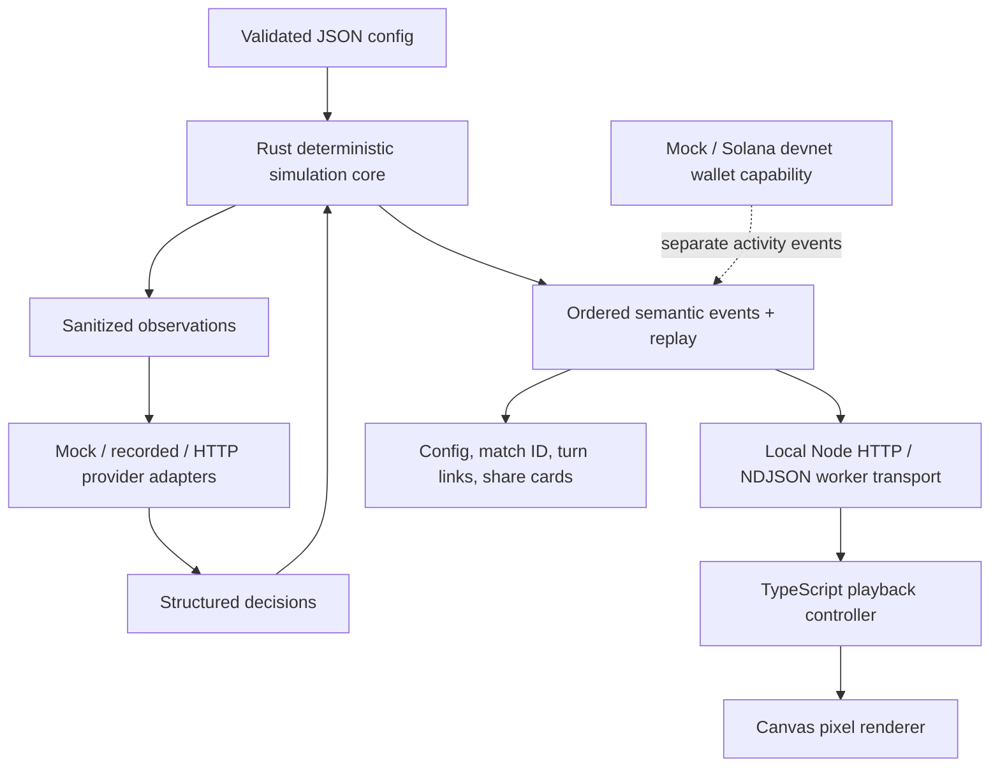

# Last Seat: architecture and vertical slice

## Review of the existing game

The JS RPS engine has useful escrow, policy, commitment verification and idempotent settlement tests. Keep it as the economic reference demo. Its spectator game has weak pacing: random pairs leave most avatars idle, elimination is buried in policy/accounting details, and strategy labels overstate how different the underlying algorithms are. The screen prioritizes cards and financial tables over the board. Browser animation callbacks control orchestration latency. Saved histories are inspectable but cannot drive a full scrubbed playback. Rust is an isolated accounting example; there is no TypeScript or provider adapter yet.

## Ship one clear game

**Last Seat**: a small table, credits, four actions, rising upkeep, the last agent with credits wins. No health, sanity, inventory, influence, or reputation meters. A temporary guard and visible alliance ribbon represent actual interactions, not extra resource systems.

| Phase | Resolution |
|---|---|
| World | Seeded market conditions determine work income. Upkeep is 1 + floor((turn - 1) / 4). All conditions are public. |
| Observation | All living agents receive the same pre-action state, plus their own config and recent public actions. |
| Decide | Each living agent submits one validated action and short reason. Decisions are gathered before any action resolves. |
| Resolve | Guard flags lock first; other actions use seeded rotating initiative. Mutual cooperation grants a bonus once per pair. |
| Upkeep | Living agents pay upkeep, clamped at available credits. Credits at zero means eliminated. |
| Finish | One living agent wins; zero survivors is a draw; at max turns the unique richest survivor wins, or tied leaders draw. |

| Action | Requirements | Effects | Visual mapping |
|---|---|---|---|
| Work | Living agent | Earn this round's public market income (2–4); vulnerable to challenge | Hammer, gold sparks, +credits |
| Challenge | 1 credit, a different living target | Pay 1; guarded targets block; otherwise transfer up to 4 target credits (5 if target works) | Move toward target, impact/shake, transfer arc |
| Guard | Living agent | Earn 1; block all challenges this round | Shield, blue ring |
| Cooperate | 1 credit, different living target | Mutual pairs each earn 3; unilateral offers transfer 1; record alliances and betrayal | Heart/handshake, ribbon, trade particles |

Work creates capital; challenges transfer it; upkeep burns it. These are game credits, **not SOL**. This is a seeded local sandbox, not verifiable economic randomness. No chance-based real-value game is introduced.

## Screen layout

```text
LAST SEAT                 TURN / ALIVE             New / config
┌─────────────────────────────────────────────────────────────┐
│           avatar + credits         avatar + credits         │
│                                                             │
│                 SMALL WOODEN GAME TABLE                     │
│                 world condition / winner                    │
│                                                             │
│           avatar + credits         avatar + credits         │
└─────────────────────────────────────────────────────────────┘
compact explanation ticker
Play / pause / step / 1x 2x 4x / turn scrubber / replay / share
important moments                     inspect selected agent
```

The canvas is the hero. Four seats occupy table corners; larger populations use an ellipse. Keep muted parchment/wood colors, readable sprites, resource bars, short semantic action animations, and visibly empty eliminated seats. Inspector and config are secondary.

## Architecture



Rust owns state, RNG, validation, action resolution, elimination, winners, and replay verification. Node owns process lifetime, local HTTP, disk replay files, and optional provider I/O. TypeScript owns presentation state, queue timing, inspection, sharing, and replay scrubbing. The renderer never resolves an action. HTTP suits one turn at a time; no WebSocket dependency is needed for this slice. A persistent Rust JSON-line worker avoids rebuilding/spawning the core per animation. Later streaming transport can carry the same events unchanged.

Every replay contains version, seed/config, initial state, ordered semantic events (including decisions), final state, winner, and statistics. `RoundEnded` carries a renderer checkpoint. Replay verification reruns rules using recorded decisions; live model calls are not repeated. Mock runs must be byte reproducible. Match IDs hash the config and actual events, avoiding collisions between different model decisions under identical settings.

## Agent and model boundary

Agent config includes id, name, sprite, strategy, personality, prompt summary/full prompt, provider/model, starting credits, and wallet_enabled. Secrets live only in server environment, never config or replay. Built-in mock strategies are aggressive, conservative, opportunist, and cooperative; they respond to observed resources and recent actions. A custom adapter receives an observation and returns `{agent_id, action, target, reason}`. HTTP adapters use an explicitly configured local/server endpoint and record actual decisions. Invalid output or timeout deterministically falls back to guard with an event explaining why.

## Spectator and X boundary

| Slice | Future boundary |
|---|---|
| Click agent; see model/personality, credits, reason, recent actions | Authenticated model registries |
| Favorite locally; copy config; remix with altered seed/resources | Public saved follows and galleries |
| Replay from 0; scrub turns; jump to eliminations/betrayals | Hosted replay storage, stable public URLs |
| Copy turn/result URL and factual text; download canvas share card | Video/clip exporter |
| `/api/matches`, `/api/replays/:id` | X gateway commands: run, replay, why, remix |

No X publishing is implemented. A future gateway parses those four commands and calls the same run/replay endpoints under rate limits and inference budgets. It cannot bypass core validation or wallet policy. Localhost links work locally; public sharing requires hosting this service.

## Wallet boundary

Wallets are optional capability demonstrations, separate from survival credits. Keep the existing JS wire/signing demo. Add a Rust mock/devnet wallet example with ephemeral keys, optional test-key loading, balance reads, faucet, tiny capped transfers, message signing/verification, and semantic wallet activity. Fixed devnet genesis verification, local mock default, explicit transfer flags, spending caps, no mainnet endpoint or personal key requirement. Wallet execution is never triggered by untrusted model text.

## Acceptance checks

- 2, 4, 8, and 20 agents; custom configs and seeds; no dependence on a model or wallet.
- A 2–4 agent match starts, has observable decisions, changing credits, elimination, winner/draw, restart, pause, step, and 1x/2x/4x.
- At least work, challenge, guard, cooperation, and elimination have distinct animations.
- Replays animate from stored events without calling game rules or providers in the browser.
- Rust rule/seed/replay tests; TypeScript checks; HTTP integration; visible desktop/mobile smoke test and screenshot inspection.
