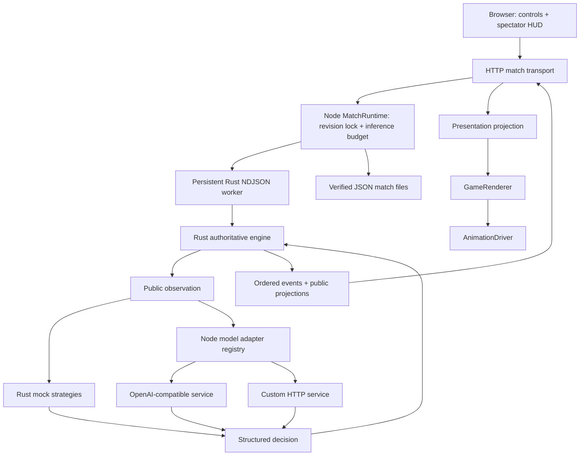
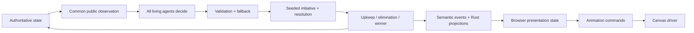
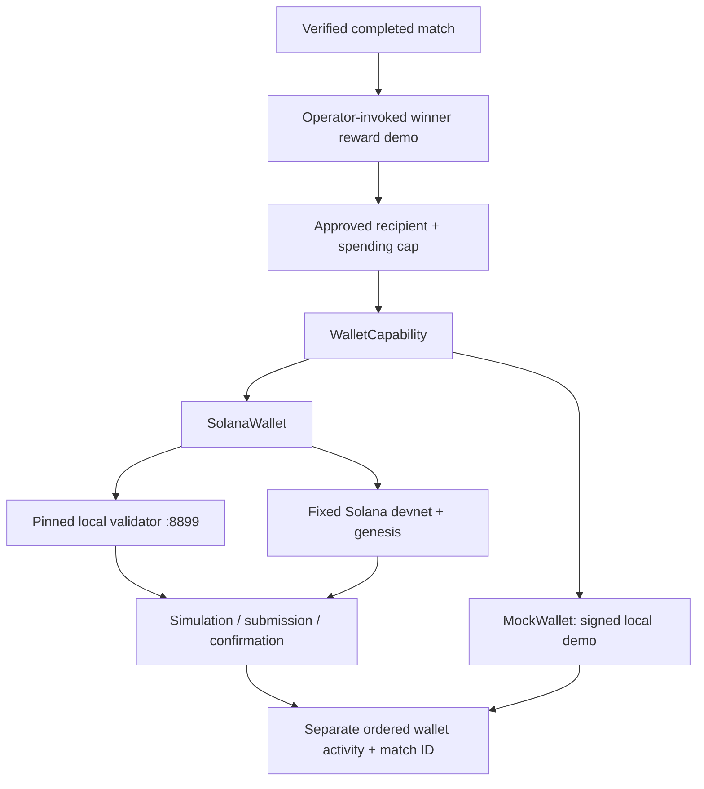
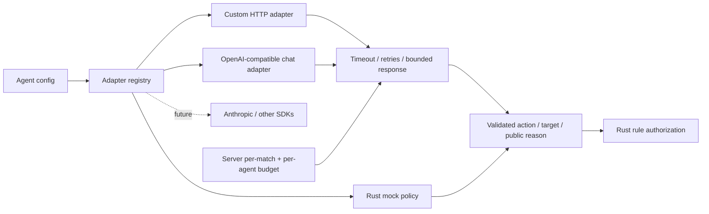
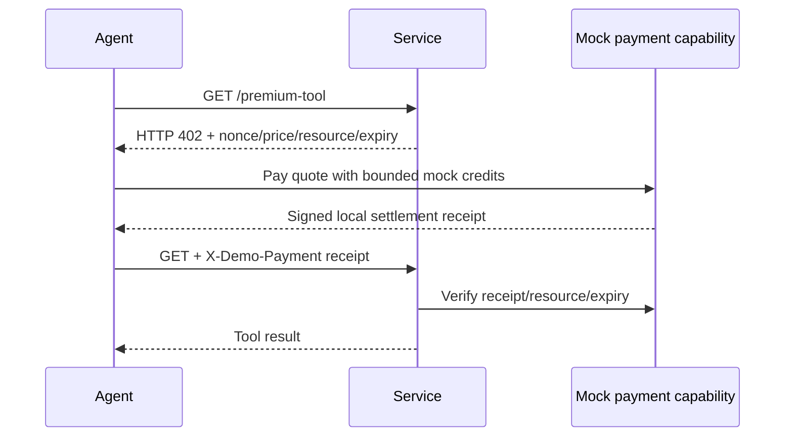

# Live architecture

## System

## Simulation flow

## Crypto capability

Wallet activity does not change credits, winner selection or seeded game history. No browser/API route can initiate a network transfer. The CLI verifies the supplied match before associating a reward with its winner. Confirmed/failed/requested transaction activity is a separate capability stream, preserving deterministic game history.

## Model adapters

A provider's explain method returns the public decision reason. It cannot read wallet keys or execute transactions. The server chooses the credential destination and environment variable; public configs cannot redirect secrets. Inference reservations count failed attempts and retries.

## Payment experiment

This experiment is x402-inspired, not x402 wire compatible and not an on-chain payment. Repeated delivery is idempotent. An actual facilitator/settlement adapter is planned.
