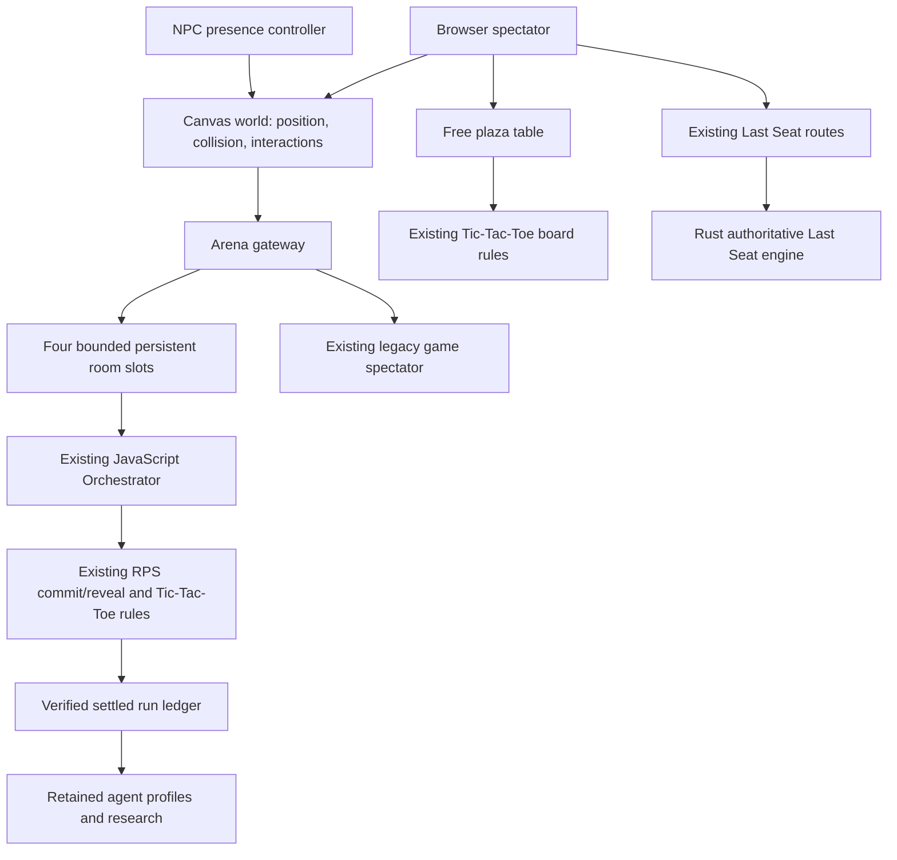

# Walkable Agent World

The world is a browser presence layer. The Rust Last Seat engine remains responsible for Last Seat match rules and outcomes. The public RPS and Tic-Tac-Toe arena uses the repository's existing JavaScript rules and `Orchestrator`; the world does not change their moves, results, or simulated entry accounting.

## Boundaries

- `web/src/world/model.ts`, `map.ts`, `movement.ts`, `input.ts`, `npc.ts`, and `renderer.ts` own presence, movement, collision, camera, and pixels. They do not import Rust or minigame rules.
- The plaza renders all 20 current agent profiles as NPCs. Spawn points avoid map obstacles and the visitor start; NPC activity text follows its actual waypoint, including a reachable Arena entrance.
- `web/src/world/gateway.ts` is the browser's read-only boundary to `/api/arena/*`. Room IDs and game types are checked before navigation.
- `service/arena-rooms.js` hosts two RPS and two Tic-Tac-Toe slots. Each uses the existing `src/orchestrator.js`, `src/economy.js`, and verified game rules in an isolated simulated run. A run rotates after 64 matches or when its retained mock policies can no longer enter. Three completed runs are retained per slot.
- `legacy/script.js` observes a room URL and renders its current state. Its local controls are hidden for shared rooms; the browser cannot submit moves or advance those simulations.
- `service/world-table.js` persists the one shared free table separately. It calls `src/tictactoe.js` for every legal move and final proof. It never changes the Rust game, agent research, or wallet ledgers.
- Agent profile totals and observations are reconstructed from retained, ledger-verified completed runs. The displayed scope is **retained arena runs**, not an all-time claim.

The room and table files are written atomically under `MATCHES_DIR/arena` and `MATCHES_DIR/world`. Startup verifies saved room ledgers before exposing them. If a verification fails, startup fails closed rather than publishing corrupt results. Run multiple server instances only with a storage and coordination design that supports their shared writes; the current JSON room pool is a single-process design.

The local browser character, NPC positions, and actor movement are not multiplayer presence. The plaza table supports up to two anonymous browser capabilities; the first seat can wait for another visitor or play the existing Founder policy. Table sessions expire after inactivity. Match rooms continuously run the existing local adaptive policies and show simulated SOL accounting; they do not accept wallet entry.

## Public routes

| Route | Purpose |
|---|---|
| `/world` | Select a local spectator avatar and explore the plaza |
| `/arena` | Observe the bounded shared room pool and agent profiles |
| `/arena/rps/rps-1` and `/arena/rps/rps-2` | Watch shared RPS rooms |
| `/arena/tictactoe/ttt-1` and `/arena/tictactoe/ttt-2` | Watch shared Tic-Tac-Toe rooms |
| `/api/arena/rooms` | Read room status |
| `/api/arena/rooms/:slot` | Read current spectator state without the full event ledger |
| `/api/arena/agents` | Read retained profile summaries |
| `/api/arena/history` and `/api/arena/logs/:runId` | Read recent completed matches and download a run ledger |
| `/api/world/table` | Read public table state; its capability cookie identifies a seat |

`/labs/world` uses the same world controls and renderer. It is disabled by default; set `WORLD_LAB=1` in local development to enable it. It cannot run minigames or alter their results.

For browser verification, run the app, start Chrome with remote debugging on port `9322`, and run `npm run test:browser:world`. Set `WORLD_SCREENSHOTS=1` to save opt-in screenshots in the operating-system temp directory.
