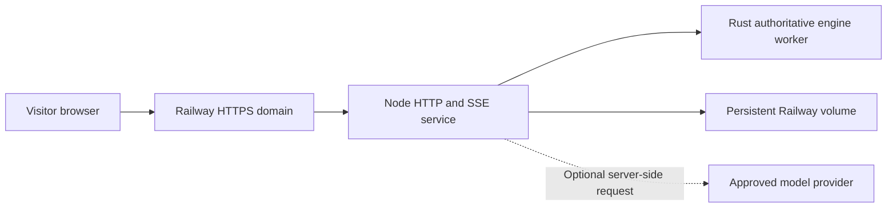

# Deploying the public free-match website

This repository can host **free, seeded Last Seat matches** with read-only live spectators. The `/rps` and tic-tac-toe economy is currently a browser-local **simulated SOL** experiment. Do not ask visitors to send SOL to its generated mock addresses. An explicit opt-in Devnet mode exists for public test-SOL experiments; it is documented separately and never enables mainnet custody.

## Railway topology

The app uses **one service** and a persistent volume, not PostgreSQL. The volume holds match checkpoints, archived histories and, in local development only, economy journals. Rendering state stays in the browser. Railway's single replica must stay attached to the same volume. A multi-replica deployment needs a transactional shared store and cross-instance event transport first.

## Deploy

1. Push this repository to GitHub. Create a Railway project and add a service from the repository. Railway reads `railway.toml` and builds the `Dockerfile`.
2. Add a Railway volume, mounted at `/data/matches`. This is required; an ephemeral container filesystem loses live checkpoints on restart.
3. Generate a stable secret (for example `openssl rand -hex 32`) and set `HOST_SESSION_SECRET` to its output. Keep it private and unchanged across redeploys; rotating it invalidates active host cookies.
4. Set `NODE_ENV=production` and `MATCHES_DIR=/data/matches`. The image sets these defaults, but verify them in the service settings. Railway supplies `PORT`; do not hard-code it. Leave `ECONOMY_LAB`, `MACHINE_PAYMENTS_DEMO` and `ENTRY_FEE_ENABLED` unset.
5. Generate a temporary Railway public domain. `RAILWAY_PUBLIC_DOMAIN` automatically supplies the approved HTTPS origin; or set `PUBLIC_ORIGIN=https://your-domain.example` when you add your custom domain. The temporary Railway origin remains allowed for health checks.
6. Deploy. Railway runs `node server.js`. Check `https://<temporary-domain>/api/health` for `ok: true` and `storage: ok`. Open the root page, create a match, advance a turn, copy a watch link, and open it in a second browser. That browser should watch but must not advance the host's game.
7. On Railway, inspect deployment logs if startup fails. The process exits with a specific message for a missing origin, volume path or host secret. A failed engine/storage health check returns non-200.

There are **no database migrations** in this topology. `npm ci` and `npm run build` happen inside the Docker build. The exact runtime command is `node server.js` (`npm start` is equivalent after build).

## Custom domain with Cloudflare

1. In Railway, add your domain to the web service and copy the exact DNS records Railway displays.
2. In Cloudflare DNS, create Railway's CNAME and any verification TXT record. Follow the values shown for your service; they are not hard-coded in this repository.
3. Set `PUBLIC_ORIGIN=https://your-domain.example` in Railway and redeploy. Keep the generated Railway domain until the custom domain works.
4. Wait for Railway's certificate status to become active. Visit `https://your-domain.example/api/health` and the match page; confirm HTTPS and a working read-only watch link. If using Cloudflare proxying, use a TLS mode that validates Railway's certificate.

## Environment

| Variable | Production | Meaning |
|---|---|---|
| `NODE_ENV` | Required: `production` | Enables public-host safety checks and host-only mutations |
| `MATCHES_DIR` | Required absolute persistent path | Match and archive JSON storage; mount a volume there |
| `HOST_SESSION_SECRET` | Required, 32+ characters | Signs host-only session cookies; never expose in browser |
| `PUBLIC_ORIGIN` | Required unless Railway domain exists | Canonical HTTPS origin, no path or trailing slash |
| `RAILWAY_PUBLIC_DOMAIN` | Railway-provided alternative | Temporary approved HTTPS host |
| `PORT` | Hosting-provided | HTTP listener port; defaults to 3000 |
| `MODEL_BASE_URL`, `MODEL_API_KEY_ENV` | Optional | Explicit approved model endpoint and server-side key variable name |
| `ECONOMY_LAB`, `MACHINE_PAYMENTS_DEMO` | Must remain off | Local development demonstrations only |
| `ENTRY_FEE_ENABLED` | Off for free launch | Set only with the complete experimental Devnet variable set |

Mock strategies need no provider key. If an optional model provider fails, the bounded fallback policy applies. Never put API keys in agent JSON, frontend files, logs or public Railway variables.

## Verify and recover

Local production-shaped check: `npm ci && npm run build && npm run verify:production` (set the three production variables first). It checks configuration, assets, the Rust worker, and the public health endpoint through the production integration test. A full unit/engine gate is `npm test && npm run lint`.

For rollback, redeploy the last known-good Git commit while keeping the same mounted volume and host secret. Match histories use versioned rules; avoid deleting or replacing the volume. If the service cannot restore a damaged checkpoint it exits rather than silently discarding critical state. Copy the volume before manual recovery and use the JSON archive/verification tooling documented in [persistence](persistence.md).

## Payment boundary

The public site may be launched **today as a free demo**. An opt-in [public Devnet path](public-devnet.md) now generates genuine testnet addresses and Solscan links behind explicit production variables. Its full public entry/payout still needs a funded run against the exact deployment RPC before promotion. Local-validator keys and mock addresses must never be shown as fundable public addresses. Mainnet stays disabled. See [mainnet readiness](mainnet-readiness.md) and [trust boundaries](trust-boundaries.md).
