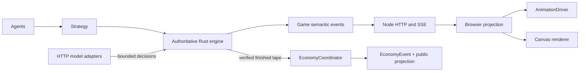
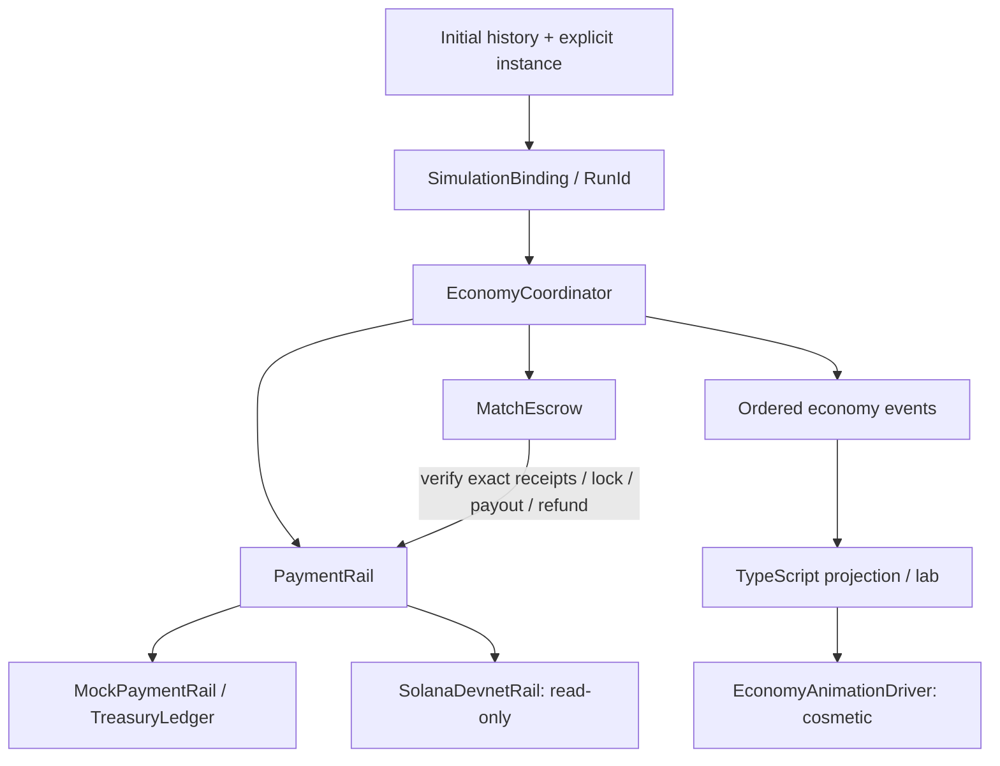
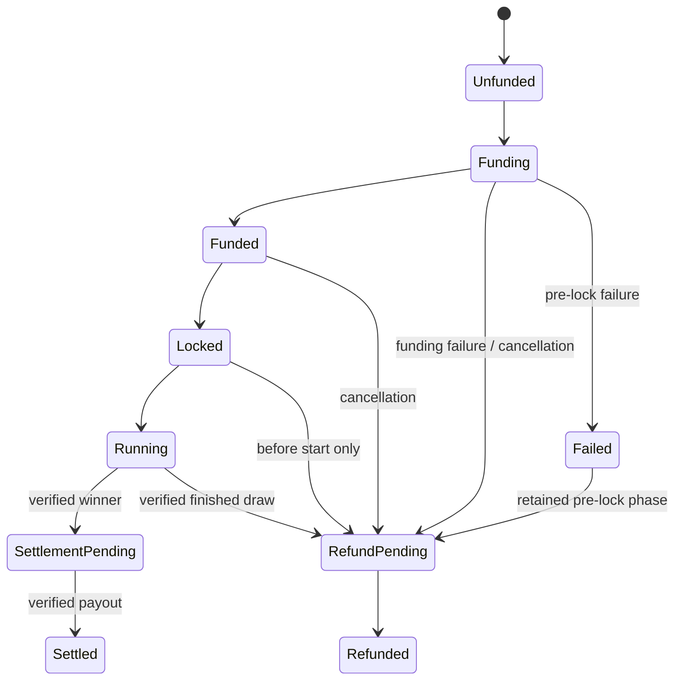
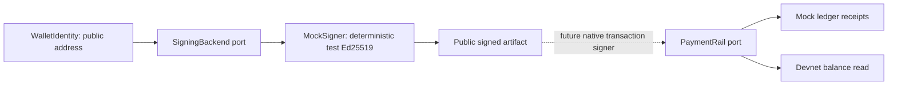

# Economy sidecar architecture

The existing V6 simulation remains unchanged. `rust/src/economy` owns an independent
match funding lifecycle. Rust validates authoritative results; the UI only projects
semantic events. Demo/lab instances are mock-only, ephemeral and not admission control
for the normal live table.

The diagram shows operational paths, not every enum edge. `lifecycle.rs` defines
structural transitions; `refund.rs` and `settlement.rs` additionally enforce authority.
An ambiguous payout remains `SettlementPending` and can only retry its original intent.

The signing and payment ports are deliberately independent today. The mock rail does
not pretend to submit signed Solana transactions. The separate `wallet-demo` remains
the existing native Solana wire demonstration.

| Concern | Module / authority |
|---|---|
| Amounts and identity | `primitives`: checked integer units, validated IDs, string JSON amounts |
| Configuration | `config`, `scenario`: exact decimal SOL strings, entry cap/reserve, mainnet rejection |
| Payments | `rail`, `mock_rail`: canonical intents, verification, idempotent receipts |
| Escrow | `escrow`, `mock_escrow`: verified deposits, exact pot, lock, retry/refund accounting |
| Lifecycle | `coordinator`, `settlement`, `refund`: binding, funding, verified winner, explicit policy |
| Wallet boundary | `signing`, `mock_signer`: address-only identity, secret-free artifacts |
| Testnet boundary | `devnet`: fixed endpoint/genesis, bounded public keys, integer balance reads |
| Demonstrations | `demo`, `lab`: zero-paid-inference mock matches and public projections |
| Frontend | `economy.ts`, `economy-animation.ts`: parse/reduce events, optional cosmetic effects |

`RunId` remains stable throughout economy events. Game history IDs change with the
decision tape; the binding records the starting history and settlement records the
finished history. Explicit instance IDs distinguish two runs of the same configuration.
Events start at sequence **0**. Cross-run streams and missing sequence numbers fail;
clients fetch a complete snapshot rather than calculating replacement balances.

`replay::verify` proves rule consistency, not that an untrusted tape came from the
host. Real-funded settlement needs the trusted completion/durable journal described
in [mainnet-readiness](mainnet-readiness.md) and [threat model](threat-model.md).
