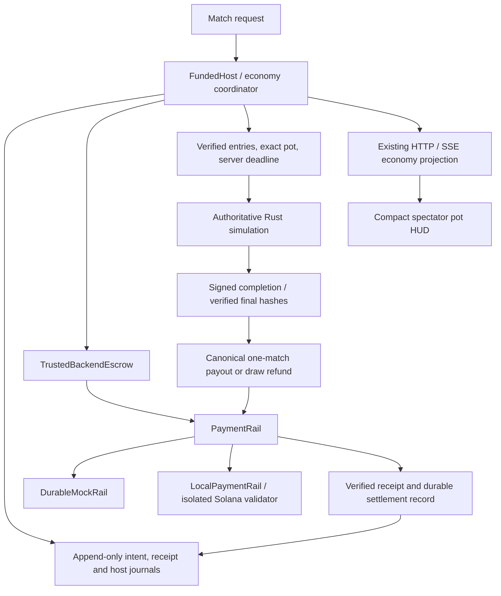
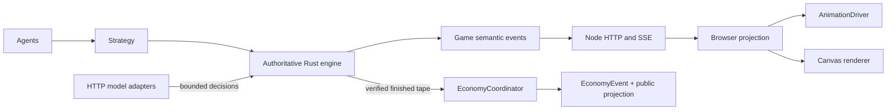
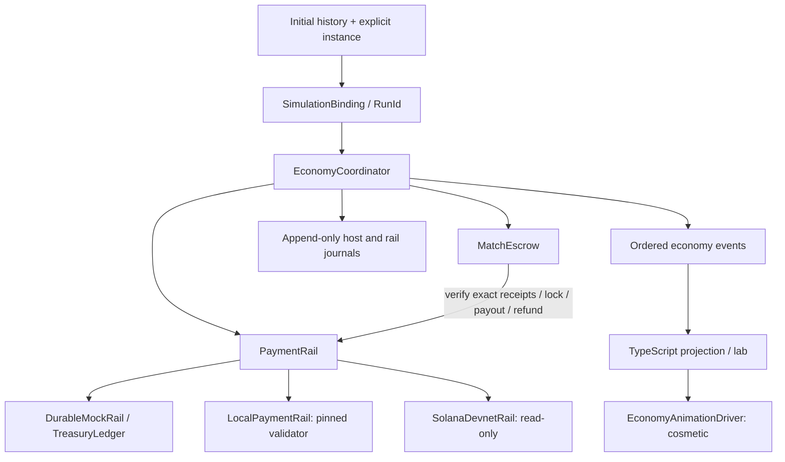
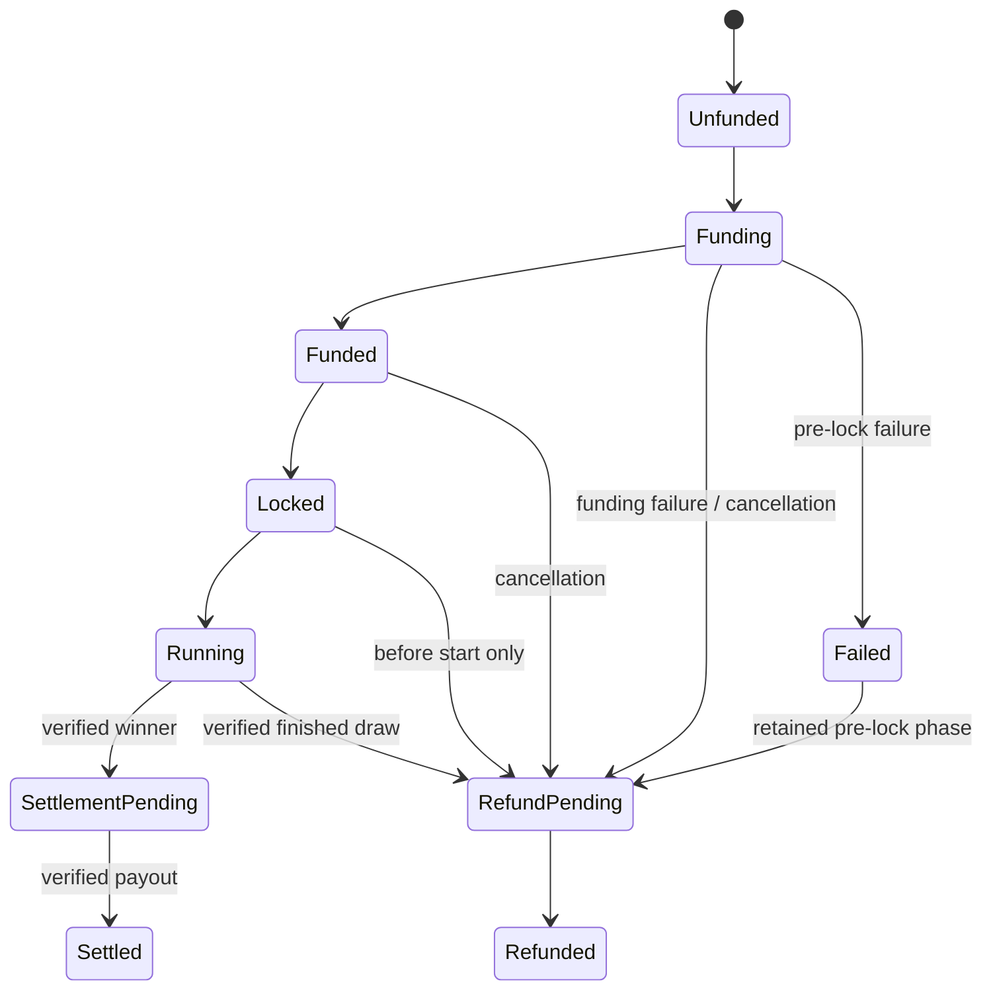
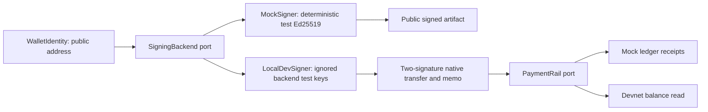

# Economy sidecar architecture

The existing V6 simulation remains unchanged. `rust/src/economy` owns an independent
match funding lifecycle. Rust validates authoritative results; the UI only projects
semantic events. The normal live table remains free. Opt-in funded matches use a durable Rust host
for admission, mock or pinned local backend custody, and completion attestation.

The local branch uses trusted backend test wallets and a separate fee sponsor.
It is not smart-contract escrow. Signed bytes/reference persist before broadcast;
reconciliation verifies known operations without creating transactions.

The diagram shows operational paths, not every enum edge. `lifecycle.rs` defines
structural transitions; `refund.rs` and `settlement.rs` additionally enforce authority.
An ambiguous payout remains `SettlementPending` and can only retry its original intent.

The mock signing and payment ports remain independent. LocalPaymentRail uses
LocalDevSigner for persisted native signed transactions. The mock rail does
not pretend to submit signed Solana transactions. The separate `wallet-demo` remains
the existing native Solana wire demonstration.

| Concern | Module / authority |
|---|---|
| Amounts and identity | `primitives`: checked integer units, validated IDs, string JSON amounts |
| Configuration | `config`, `scenario`: exact decimal SOL strings, entry cap/reserve, mainnet rejection |
| Payments | `rail`, `durable_rail`, `local_rail`: exact intents, persisted signed bytes, verified receipts |
| Host / storage | `host`, `attestation`, `repository`, `recovery`: admission, signed completion, atomic journals |
| Escrow | `escrow`, `mock_escrow`: verified deposits, exact pot, lock, retry/refund accounting |
| Lifecycle | `coordinator`, `settlement`, `refund`: binding, funding, verified winner, explicit policy |
| Wallet boundary | `signing`, `mock_signer`: address-only identity, secret-free artifacts |
| Testnet boundary | `devnet`: fixed endpoint/genesis, bounded public keys, integer balance reads |
| Demonstrations | `demo`, `lab`: zero-paid-inference mock matches and public projections |
| Frontend | `economy.ts`, `economy-animation.ts`: parse/reduce events, optional cosmetic effects |

`RunId` remains stable throughout economy events. Game history IDs change with the
decision tape; the binding records the starting history and settlement records the
finished history. Explicit instance IDs distinguish two runs of the same configuration.
Events start at sequence **0**. Cross-run streams and missing sequence numbers fail;
clients fetch a complete snapshot rather than calculating replacement balances.

`replay::verify` proves rule consistency, not that an untrusted tape came from the
host. FundedHost implements trusted completion and durable journals, under test-only
backend custody. Production gaps are described
in [mainnet-readiness](../security/mainnet-readiness.md) and [threat model](../security/threat-model.md).

See [API](../architecture/api.md), [event schemas](../architecture/events.md), [recovery diagrams](./failure-recovery.md),
and [trust boundary diagram](../security/trust-boundaries.md).
