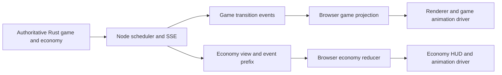

# Live transport and economy boundary

The free game uses HTTP to start/step a host match and SSE to stream semantic
transitions to read-only spectators. Node checkpoints histories/inference budgets;
Rust owns game state. Viewer pause never sends an engine step.

Opt-in funded matches now use FundedHost admission, durable host/rail journals and
signed completion verification. Mock and pinned local backend custody are supported;
public Devnet funded admission is opt-in and experimental; mainnet is disabled. The Rust
host starts turns only after all required entries are verified and funds locked.

Node publishes economy snapshots on the separate SSE `economy` channel alongside
`transition` game events. Connect/reconnect includes a full `snapshot`. Economy
snapshots contain event prefixes; the TypeScript reducer rejects gaps/cross-instance
streams and ignores duplicates. The UI displays authoritative amounts/status and
never computes payouts or accepts animation completion as proof.

| Boundary | Current owner | Limit |
|---|---|---|
| Winner / survival | Rust engine | Browser claims never authoritative |
| Public reason | Server-generated summary from structured action | Provider free-text reasoning is discarded |
| Economy identity | Rust binding + explicit instance | Separate from changing history hash |
| Admission / settlement | FundedHost + escrow + rail | Backend custody, test-only |
| Recovery | Host snapshot + rail journal + authority key | Single writer/local filesystem |
| Game/economy transport | Node SSE | Reconnect snapshot, no global channel ordering or durable cursor replay |
| Rendering/effects | Replaceable browser drivers | Cosmetic only |

The economy lab reset selects a new durable mock instance; it does not erase old
payment evidence. Existing [spectator behavior](../architecture/live-spectators.md) and
[session recovery](../architecture/persistence.md) remain applicable. See [event schemas](../architecture/events.md),
[API](../architecture/api.md), [funded recovery](./failure-recovery.md) and [trust boundaries](../security/trust-boundaries.md).
