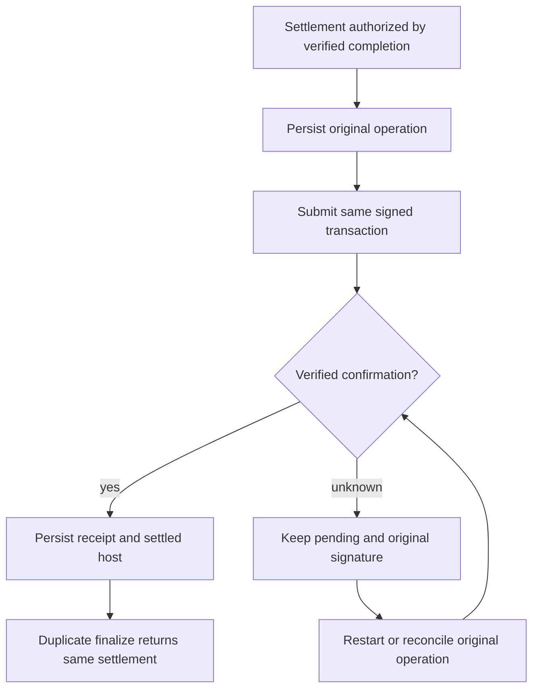
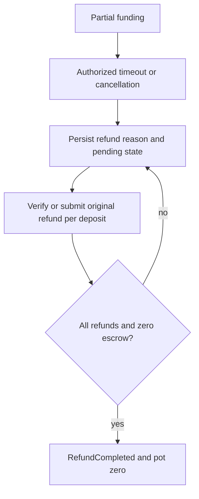

# Failure and recovery

FundedHost persists a host snapshot and a separate rail operation journal. Payment
operations bind match, purpose and accounts; retries reuse the original intent and
signed transaction. The storage lease permits one writer. Recover by preserving
both journals and test keys, not by recreating an ambiguous match.

| Failure | Current behavior / operator action |
|---|---|
| Frontend reload | Fetch current host view; SSE starts with snapshot. Local favorites/pause are presentation only. Funded scheduler continues independently. |
| Backend restart | Verify session config, replay/binding, participants, pot/events and completion attestation; reload rail. Node restores checkpoints, lists funded sessions, and resumes pending work. Invalid recovery stops startup. |
| RPC unavailable | No incomplete evidence becomes success. Intent survives preparation failure; public balances may be null. Scheduler backs off 2–60 seconds and pauses automatic retries after eight failures. Explicit reconcile/settle/cancel resets that limit. Retain original operations and wait for the pinned validator. |
| Confirmation delayed | Exact signed bytes/signature are saved before broadcast. Reconcile original signature. Never re-sign or choose a different winner to escape ambiguity. |
| Settlement confirmed, host stale | Reconcile rail receipt before testing the stale escrow balance; do not debit twice. Finalize validates completion and preserves the same settlement identity. |
| Refund interrupted | RefundPending retries existing reason. Deposits already returned are skipped or recognized by the rail; completion waits for zero escrow balance. |
| Match host dies before result | Restart restores verified replay. Locked/running matches cannot be casually cancelled; no guessed winner is paid. |
| Funding timeout | Funding or newly recovered Funded state past the deadline cannot be admitted. Explicit expiry/scheduler performs authorized refunds; verification-only reconciliation cannot create them. Running matches do not time out as unfunded. |
| Model response malformed/500/timeout | Bounded attempt consumes budget; retry if permitted, then deterministic configured fallback. No response text authorizes funds. |
| Journal corrupt or semantically inconsistent | Reject restore. Stop writers, preserve evidence/backups; investigate. A checksum detects accidental corruption, not a malicious operator. |

Use `npm run economy:reconcile -- SESSION` (omit SESSION for all funded sessions).
It is verification-only: it does not blindly submit new transactions. Automatic
scheduler recovery or an explicit settle/cancel action performs authorized retry.
`ECONOMY_LOG=1 npm start` emits safe event/retry JSON on stderr.
`GET /api/economy/health` is cached observation; run doctor for preflight.

Stop the app before copying/restoring directories. Keep MATCHES_DIR, ECONOMY_DIR,
local ledger and host authority together. Do not delete rail revisions, rotate test
keys or reset a validator while unresolved operations exist. See
[local validator lifecycle](local-validator.md) and [troubleshooting](troubleshooting.md).
