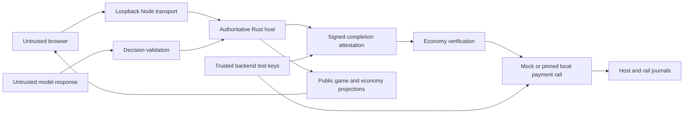

# Trust boundaries

The browser is untrusted. Config, replay, decisions, custom model output and claimed
results cross validation boundaries. Host/Origin checks and loopback binding reduce
local browser abuse; they are not user authentication or a public deployment model.

The Rust simulation host is authoritative for game state and winner/draw. Its
versioned seeded tape is verified before restore/import. Game credits do not become
wallet funds. Ordinary free matches do not create payable payment intents; the free
CLI economy sidecar deliberately retains zero-value bookkeeping receipts/events.

The funded host verifies admission and signs completion with a persisted host
Ed25519 authority. The economy service checks that attestation against the actual
finished replay and match binding before settlement. This proves what that trusted
host signed; it is not decentralized consensus, independent fairness, or proof that
the machine/operator was uncompromised.

The payment rail verifies actual payment evidence. Mock uses a deterministic ledger
and durable receipts. Local uses fixed loopback RPC, a pinned non-public genesis,
exact signed bytes/signature, successful transaction metadata, expected System
transfer, fee sponsor and operation memo. The recorded pot must match verified
entries. Signatures or status labels without matching evidence are insufficient.

Local-validator custody is **test-only backend custody**: the backend controls agent,
escrow, fee-sponsor and completion-authority keys. TrustedBackendEscrow is not an
on-chain escrow program. An operator with key/filesystem access can move funds or
change records; checksums detect corruption, not malicious privileged modification.
The single-writer JSON journal uses atomic rename/fsync and local OS locks. It is not
a replicated database; filesystem behavior, disk capacity, backups and retention
remain operational responsibilities. Preserve both host and rail revisions on recovery.

Devnet wallet demos and the opt-in funded rail use valueless test SOL. The funded rail
keeps agent/escrow keys in trusted backend storage and exposes public Solscan evidence. Mainnet competition is
disabled in config, adapters and CLI. Real-value competition is not production-ready.
No guarantee of zero vulnerabilities follows from passing tests or dependency audits.

Custom model endpoints are untrusted inputs. Server-approved destinations/key
names, no redirects, time/body/retry/budget limits and deterministic fallback contain
failures. Models can propose game actions; they cannot select wallet recipients,
sign transactions, declare a winner, or access key material. Avoid private prompts
because configured profiles and public reasons are visible to spectators.

See [security reporting](../../SECURITY.md), [recovery](../economy/failure-recovery.md), and the
[existing competition audit](./crypto-audit-2026.md) for remaining production gaps.
